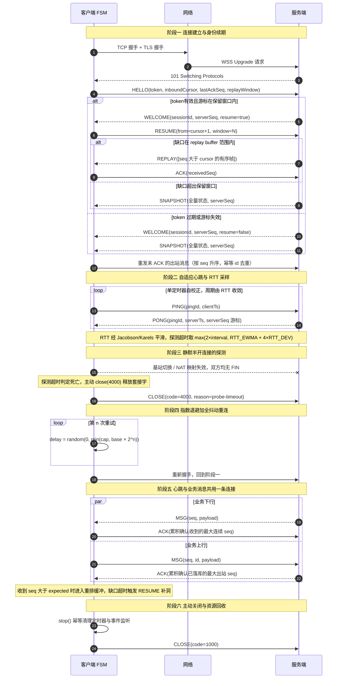
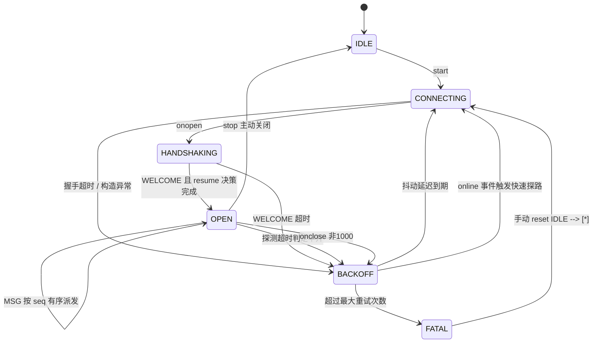

# 实时与弹性✅

本主题覆盖实时通道取舍、队列/流式削峰、弹性与回压、可观测。

## WebSocket/SSE/WebRTC 取舍？ {#p1-realtime-compare}

<Answer>

**核心概念:**

- WebSocket：全双工、低延迟；需网关/协议支持
- SSE：基于 HTTP 的单向推送，简单稳定
- WebRTC：P2P 多媒体/数据通道，NAT/信令复杂

**面试官视角:**

- 场景匹配与复杂度；降级与回退

</Answer>

## 如何用消息队列与流式计算削峰填谷？ {#p1-queue-stream}

<Answer>

**核心概念:**

- 限流/排队/幂等消费；分区与局部有序；失败重试/死信

</Answer>

## 如何设计回压与排队策略？ {#p2-backpressure}

<Answer>

**核心概念:**

- 滞留长度、消费延迟、生产速率控制；指数退避 + 抖动；资源配额

</Answer>

## 连接与会话的弹性治理？ {#p2-conn-resilience}

<Answer>

**核心概念:**

- 心跳/重连/超时；断线重传；粘滞与迁移

</Answer>

## 端到端观测指标如何定义？ {#p1-obs-slo}

<Answer>

**核心概念:**

- RUM/链路/指标与 SLO；烧速与告警

</Answer>

## 在线协作/IM 的实时一致性？ {#p2-crdt-ot}

<Answer>

**核心概念:**

- OT/CRDT 概要取舍

</Answer>

## 推送/订阅的多租户隔离？ {#p2-multi-tenant}

<Answer>

**核心概念:**

- 资源配额/隔离策略

</Answer>

## 边缘推送与离线能力？ {#p2-edge-push}

<Answer>

**核心概念:**

- SW/推送/离线策略

</Answer>

## 实时系统的压测与演练？ {#p2-rt-loadtest}

<Answer>

**核心概念:**

- 模拟连接/消息分布，端到端压测

</Answer>

## 故障注入与自愈策略？ {#p2-chaos}

<Answer>

**核心概念:**

- 故障演练/自愈回路

</Answer>


## 面对弱网与复杂网络环境，如何设计高可用前端长连接通信体系（自适应心跳、指数退避重连、消息 ACK 与离线补偿）？ {#p0-high-availability-websocket-resilience}

<Answer>

**核心结论:**

长连接高可用的本质不是"永不断线"，而是**把连接当作可随时失效的租约（lease），把状态恢复的责任收敛到服务端游标上**。由此推出四条不可妥协的结论：

1. **三大机制必须解耦成独立状态机**：探测（判定何时宣告死亡）、退避（判定何时再连）、补偿（判定重连后补什么）三者是正交职责。绝大多数线上事故的根因是把这三者塞进同一个 `onclose` 回调里，导致"退避刚结束又开始补偿、补偿超时又触发重连"的雪崩式重连。
2. **弱网下真正的敌人是"半开连接"而非"断线"**。TCP 层早已失效（基站切换、NAT 映射老化、代理静默丢包），但浏览器既收不到 FIN也不触发 `onclose`，`readyState` 仍是 `1`。因此活性判定必须由**应用层 PING/PONG + RTT 采样 + 超时阈值**驱动，绝不能依赖 `onclose` 事件。
3. **心跳必须是单定时器自校正循环，不能用 `setInterval`**。原因有三：后台标签页节流会让 `setInterval` 漂移到分钟级；`setInterval` 在回调执行期间不会重入，弱网下 `send` 阻塞会造成心跳堆积；探测与发送必须共享同一个时钟源，否则会出现"已判死但仍在发心跳"的逻辑撕裂。
4. **可靠性终点在服务端，前端只负责正确表达诉求**。客户端的职责严格限定为三件事：单调递增分配 `seq`、累积 ACK 上报 `receivedSeq`、重连时携带游标发起 `resume`。补齐逻辑（replay buffer / 全量快照降级）属于服务端，前端不得本地猜测补全。

**原理解析:**

**一、六个阶段的完整时序**



**二、状态机：为什么必须显式建模**



关键在 `OPEN --> OPEN` 的自环：健康状态下**不发生状态迁移**，只有活性时间戳在推进。绝大多数实现把心跳写成 `setInterval(sendPing)`，缺失了 `OPEN --> BACKOFF` 这条边，导致连接已死仍停留在 `OPEN` 态、UI 显示"已连接"。

**三、三条核心公式**

**探测超时（RTO）** 采用 TCP 的 Jacobson/Karels 算法（RFC 6298），而非固定值：

```
RTT_ewma ← α × RTT_sample + (1 - α) × RTT_ewma        α = 1/8
RTT_dev  ← β × |RTT_ewma - RTT_sample| + (1 - β) × RTT_dev   β = 1/4
RTO      = RTT_ewma + 4 × RTT_dev
```

`4σ` 项覆盖了移动网络基站的调度抖动，是"默认 30 秒超时"在地铁、电梯场景频繁误判的根因。探测超时还要与心跳周期解耦：`probeTimeout = max(2 × pingInterval, RTO + guard)`。

**心跳周期**必须满足三角不等式，否则纯属浪费：`pingInterval + probeTimeout < idleTimeout`。`idleTimeout` 由链路上最薄弱的一环决定——运营商 NAT 映射老化通常 5~30 分钟，企业出口代理常为 60 秒，CDN 网关常见100 秒。心跳周期超过该值的一半，网关会主动回收连接且客户端收不到任何通知。

**退避延迟**采用 AWS提出的全抖动（full jitter）：

```
ceiling = min(cap, base × factor^n)
delay   = random(0, ceiling)      // jitter = 1.0
```

等差退避（固定 1s / 2s / 4s）在服务端重启瞬间会让全部客户端**同步重连**，形成周期性惊群。全抖动把这个尖峰抹平。另有"服务端负载感知退避"：响应帧中携带 `retryAfterMs` 字段，让过载方主动把客户端推开。

**四、消息语义的两个正交序列号**

出站与入站各维护独立单调序列，出站用**累积 ACK**（收到 `ack(seq=N)` 即表示 `≤ N` 全部落库），入站则要求**严格有序派发**：收到 `seq > expected` 时先存入重排缓冲并按需发起 `RESUME` 补洞，超过重排窗口直接请求 `SNAPSHOT`。配合跨重连稳定的幂等 `id`（如 `sessionId:seq`），整个系统获得 at-least-once 投递 + 端到端幂等消费的语义保证。

**规范实现:**

```ts
/* ══════════════ 1. 协议契约 ══════════════ */

const WS_OPEN = 1;
const CLOSE_NORMAL = 1000;
const CLOSE_TIMEOUT = 4000; // 应用自定义：探测超时导致的主动回收

/** 连接状态机。UI 层只允许订阅此枚举，禁止自行推断连接状态 */
export type ConnState =
  | 'idle' | 'connecting' | 'handshaking'
  | 'open' | 'backoff' | 'fatal';

export interface HeartbeatPolicy {
  /** RTT 未知时的初始心跳周期 */
  base: number;
  min: number;
  max: number;
  /** 心跳周期相对 RTT 的放大系数，需满足 base*2 + probeTimeout < NAT 超时 */
  k: number;
  /** 探测超时的下限，吸收系统调度抖动 */
  guard: number;
}

export interface BackoffPolicy {
  base: number;
  max: number;
  factor: number;
  /** 抖动比例，1.0 = 全抖动 [0, ceiling] */
  jitter: number;
  /** 超过此次数进入 fatal，避免无限重连耗电 */
  maxAttempts: number;
}

/** 服务端下行帧，可辨识联合以便 switch 穷尽检查 */
export type ServerFrame<T> =
  | { t: 'welcome'; sessionId: string; serverSeq: number; resume: boolean }
  | { t: 'pong'; pingId: number; serverTs: number; serverSeq: number }
  | { t: 'msg'; seq: number; id: string; payload: T }
  | { t: 'ack'; seq: number }
  | { t: 'replay'; items: ReadonlyArray<{ seq: number; payload: T }> }
  | { t: 'snapshot'; state: T; serverSeq: number };

/** 抽象 socket 工厂，便于注入 Mock 做弱网仿真测试 */
export interface WebSocketLike {
  readonly readyState: number;
  readonly bufferedAmount: number;
  onopen: ((ev: unknown) => void) | null;
  onclose: ((ev: { code: number; reason: string }) => void) | null;
  onerror: ((ev: unknown) => void) | null;
  onmessage: ((ev: { data: unknown }) => void) | null;
  send(data: string): void;
  close(code?: number, reason?: string): void;
}

export interface ResilientSocketOptions<T> {
  url: string;
  getToken: () => string | Promise<string>;
  onMessage: (payload: T, seq: number) => void;
  onStateChange?: (from: ConnState, to: ConnState, ctx?: Record<string, unknown>) => void;
  /** 队列写满且无法再降级时的显式回调，禁止静默丢消息 */
  onOverflow?: (dropped: number) => void;
  heartbeat?: Partial<HeartbeatPolicy>;
  backoff?: Partial<BackoffPolicy>;
  /** 服务端 replay buffer 保留窗口，超出即降级为快照 */
  replayWindow?: number;
  /** 出站队列上限，超过后拒绝新消息而非丢弃旧消息 */
  queueLimit?: number;
  /** 浏览器发送缓冲区上限，超过则暂停 flush 形成回压 */
  maxBufferedBytes?: number;
  /** 入站缺口等待重排的超时，超时发起 RESUME */
  gapTimeout?: number;
  connectTimeout?: number;
  /** 存活多久才把退避计数清零，避免"连上即断"造成重连风暴 */
  stableUptime?: number;
  socketFactory?: (url: string, protocols: string[]) => WebSocketLike;
}

type TimerKey = 'heartbeat' | 'backoff' | 'connect' | 'gap';

/* ══════════════ 2. 主实现 ══════════════ */

export class ResilientSocket<T = unknown> {
  readonly #opt: Required<Omit<ResilientSocketOptions<T>, 'heartbeat' | 'backoff' | 'onStateChange' | 'onOverflow'>> &
    { heartbeat: HeartbeatPolicy; backoff: BackoffPolicy; onStateChange?: ResilientSocketOptions<T>['onStateChange']; onOverflow?: ResilientSocketOptions<T>['onOverflow'] };

  #ws: WebSocketLike | null = null;
  #state: ConnState = 'idle';
  #attempt = 0;
  #stopped = false;

  #timers: Partial<Record<TimerKey, ReturnType<typeof setTimeout>>> = {};

  // —— 活性探测 ——
  #pingId = 0;
  #pingSentAt = new Map<number, number>();
  #nextPingAt = 0;
  #lastPongAt = 0;
  #connectedAt = 0;
  #rtt: { ewma: number; dev: number } = { ewma: 0, dev: 0 };

  // —— 出站：seq 分配 + 幂等重放 ——
  #outSeq = 0;
  #ackedSeq = 0;
  #outbox: Array<{ seq: number; id: string; payload: T; sentAt: number; tries: number }> = [];

  // —— 入站：严格有序派发 ——
  #inboundCursor = 0;
  #pending = new Map<number, T>();

  constructor(options: ResilientSocketOptions<T>) {
    this.#opt = {
      ...options,
      replayWindow: options.replayWindow ?? 200,
      queueLimit: options.queueLimit ?? 500,
      maxBufferedBytes: options.maxBufferedBytes ?? 256 * 1024,
      gapTimeout: options.gapTimeout ?? 3000,
      connectTimeout: options.connectTimeout ?? 10_000,
      stableUptime: options.stableUptime ?? 30_000,
      heartbeat: { base: 15_000, min: 5_000, max: 30_000, k: 4, guard: 10_000, ...options.heartbeat },
      backoff: { base: 500, max: 30_000, factor: 2, jitter: 1, maxAttempts: 12, ...options.backoff },
      socketFactory: options.socketFactory ?? ((url, protocols) => new WebSocket(url, protocols)),
    };
  }

  /* ── 生命周期 ── */

  start(): void {
    if (this.#state !== 'idle') return;
    this.#stopped = false;
    this.#connect();
  }

  /** 幂等清理：必须解绑 document/window 监听，否则多次挂载导致定时器泄漏 */
  stop(): void {
    this.#stopped = true;
    this.#clearAllTimers();
    this.#pingSentAt.clear();
    document.removeEventListener('visibilitychange', this.#onVisibility);
    window.removeEventListener('online', this.#onOnline);
    window.removeEventListener('offline', this.#onOffline);
    this.#teardownSocket(CLOSE_NORMAL);
    this.#setState('idle');
  }

  /** 从 fatal 恢复，供"重试"按钮调用 */
  reset(): void {
    if (this.#state !== 'fatal') return;
    this.#attempt = 0;
    this.#stopped = false;
    this.#setState('idle');
    this.#connect();
  }

  get state(): ConnState { return this.#state; }
  get buffered(): number { return this.#outbox.length; }

  /* ── 发送 ── */

  /**
   * 返回 false 表示队列已满被拒。调用方必须感知背压，
   * 不允许把 false 当作已发送。
   */
  send(payload: T): boolean {
    if (this.#outbox.length >= this.#opt.queueLimit) {
      this.#opt.onOverflow?.(this.#outbox.length);
      return false;
    }
    const seq = ++this.#outSeq;
    this.#outbox.push({
      seq,
      // 幂等键跨重连稳定，服务端据此去重，实现 at-least-once + 幂等消费
      id: this.#opt.url + '#' + seq,
      payload,
      sentAt: 0,
      tries: 0,
    });
    this.#flush();
    return true;
  }

  #flush(): void {
    if (this.#state !== 'open') return;
    const ws = this.#ws;
    if (!ws) return;
    // 回压：弱网下 bufferedAmount 会单调增长，不设闸门将撑爆内存
    if (ws.bufferedAmount > this.#opt.maxBufferedBytes) return;
    for (const item of this.#outbox) {
      if (item.sentAt > 0) continue;   // 已发出，等待 ACK
      this.#writeRaw({ t: 'msg', seq: item.seq, id: item.id, payload: item.payload });
      item.sentAt = now();
      item.tries += 1;
    }
  }

  /* ── 连接与握手 ── */

  async #connect(): Promise<void> {
    if (this.#stopped || this.#state === 'open' || this.#state === 'connecting') return;
    this.#setState('connecting');
    let ws: WebSocketLike;
    try {
      const token = await this.#opt.getToken();
      // await期间可能已被 stop /再次 backoff，状态守卫不可省
      if (this.#stopped || this.#state !== 'connecting') return;
      ws = this.#opt.socketFactory(this.#opt.url, ['relient.v1', token]);
    } catch {
      this.#enterBackoff('connect-throw');
      return;
    }
    this.#ws = ws;
    ws.onopen = () => this.#onOpen();
    ws.onclose = (ev) => this.#onClose(ev);
    // error 事件不携带可恢复信息，统一收敛到 onclose 处理，避免重复退避
    ws.onerror = () => { /* noop */ };
    ws.onmessage = (ev) => this.#onMessage(ev);
    this.#arm('connect', this.#opt.connectTimeout, () => {
      // TCP 连上但 WSS握手卡住（如 TLS 中间人阻断），必须主动超时
      if (this.#state === 'connecting') ws.close(CLOSE_TIMEOUT, 'handshake-timeout');
    });
  }

  #onOpen(): void {
    this.#clearTimer('connect');
    this.#setState('handshaking');
    this.#connectedAt = now();
    this.#lastPongAt = this.#connectedAt;
    this.#nextPingAt = this.#connectedAt;
    this.#writeRaw({
      t: 'hello',
      inboundCursor: this.#inboundCursor,
      lastAckSeq: this.#ackedSeq,
      replayWindow: this.#opt.replayWindow,
    });
  }

  #onClose(ev: { code: number; reason: string }): void {
    if (this.#state === 'idle') return;
    // 1000 为主动关闭，fatal 为已达重试上限，两者都不再退避
    if (this.#stopped || ev.code === CLOSE_NORMAL) return;
    this.#enterBackoff('server-close-' + ev.code);
  }

  /* ── 消息分发 ── */

  #onMessage(ev: { data: unknown }): void {
    let frame: ServerFrame<T>;
    try {
      frame = JSON.parse(ev.data as string) as ServerFrame<T>;
    } catch {
      return;   // 非法帧直接丢弃，不因一条脏数据击穿整个连接
    }

    switch (frame.t) {
      case 'welcome': {
        this.#clearTimer('connect');
        if (!frame.resume) {
          // 游标失效：以快照为基线，清空重排缓冲重新对齐
          this.#inboundCursor = 0;
          this.#pending.clear();
        }
        this.#setState('open');
        this.#attempt = 0;
        this.#writeRaw({ t: 'resume', from: this.#inboundCursor + 1, window: this.#opt.replayWindow });
        this.#flush();   // 按 seq 升序重发未 ACK 的出站消息
        this.#scheduleHeartbeat();
        break;
      }
      case 'pong': {
        const sentAt = this.#pingSentAt.get(frame.pingId);
        this.#pingSentAt.delete(frame.pingId);
        this.#lastPongAt = now();
        if (sentAt !== undefined) this.#sampleRtt(this.#lastPongAt - sentAt);
        if (now() - this.#connectedAt > this.#opt.stableUptime) this.#attempt = 0;
        break;
      }
      case 'ack': {
        // 累积确认：一次 ACK 覆盖所有小于等于 seq 的出站消息
        if (frame.seq > this.#ackedSeq) this.#ackedSeq = frame.seq;
        this.#outbox = this.#outbox.filter((it) => it.seq > this.#ackedSeq);
        break;
      }
      case 'msg':
        this.#acceptInbound(frame.seq, frame.payload);
        break;
      case 'replay':
        for (const it of frame.items) this.#acceptInbound(it.seq, it.payload);
        break;
      case 'snapshot':
        this.#pending.clear();
        this.#inboundCursor = frame.serverSeq;
        this.#opt.onMessage(frame.state, frame.serverSeq);
        break;
      default:
        this.#assertNever(frame);
    }
  }

  /* ── 入站有序性 ── */

  #acceptInbound(seq: number, payload: T): void {
    if (seq <= this.#inboundCursor) return;   // 重投递，幂等丢弃
    this.#pending.set(seq, payload);
    this.#drainInbound();
  }

  /** 只派发严格连续的前缀；缺口存在则起一次性定时器触发补洞 */
  #drainInbound(): void {
    for (;;) {
      const next = this.#inboundCursor + 1;
      if (!this.#pending.has(next)) break;
      const payload = this.#pending.get(next) as T;
      this.#pending.delete(next);
      this.#inboundCursor = next;
      this.#opt.onMessage(payload, next);
    }
    if (this.#pending.size > 0 && this.#timers.gap === undefined) {
      this.#arm('gap', this.#opt.gapTimeout, () => {
        let max = this.#inboundCursor;
        for (const s of this.#pending.keys()) if (s > max) max = s;
        this.#writeRaw({
          t: 'resume',
          from: this.#inboundCursor + 1,
          to: max,
          window: this.#opt.replayWindow,
        });
      });
    } else if (this.#pending.size === 0) {
      this.#clearTimer('gap');
    }
  }

  /* ── 心跳与探测（单定时器自校正） ── */

  #scheduleHeartbeat(): void {
    this.#clearTimer('heartbeat');
    if (this.#state !== 'open') return;
    this.#timers.heartbeat = setTimeout(
      () => this.#heartbeatTick(),
      Math.max(0, this.#nextDeadline() - now()),
    );
  }

  /** 发送时点与探测时点取较早者，一个定时器同时驱动两件事，杜绝状态撕裂 */
  #nextDeadline(): number {
    return Math.min(this.#nextPingAt, this.#lastPongAt + this.#probeTimeout());
  }

  #heartbeatTick(): void {
    if (this.#state !== 'open') return;
    const t = now();

    if (t - this.#lastPongAt >= this.#probeTimeout()) {
      // 半开判定：socket 未报错但链路已死，主动回收后进入退避
      this.#ws?.close(CLOSE_TIMEOUT, 'probe-timeout');
      this.#enterBackoff('probe-timeout');
      return;
    }
    if (t >= this.#nextPingAt) {
      const pingId = ++this.#pingId;
      this.#pingSentAt.set(pingId, t);
      // 防止弱网下 pingSentAt 无限增长
      if (this.#pingSentAt.size > 64) {
        const oldest = this.#pingSentAt.keys().next().value;
        if (oldest !== undefined) this.#pingSentAt.delete(oldest);
      }
      this.#writeRaw({ t: 'ping', pingId, clientTs: t });
      this.#nextPingAt = t + this.#pingInterval();
    }
    this.#scheduleHeartbeat();
  }

  #pingInterval(): number {
    if (this.#rtt.ewma === 0) return this.#opt.heartbeat.base;
    return clamp(this.#rtt.ewma * this.#opt.heartbeat.k,
      this.#opt.heartbeat.min, this.#opt.heartbeat.max);
  }

  /** Jacobson/Karels：RTO = EWMA + 4×DEV，覆盖基站调度抖动 */
  #probeTimeout(): number {
    const rto = this.#rtt.ewma + 4 * this.#rtt.dev;
    return Math.max(this.#pingInterval() * 2, rto + this.#opt.heartbeat.guard);
  }

  #sampleRtt(sample: number): void {
    if (this.#rtt.ewma === 0) {
      this.#rtt.ewma = sample;
      this.#rtt.dev = sample / 2;
      return;
    }
    this.#rtt.dev = 0.75 * this.#rtt.dev + 0.25 * Math.abs(this.#rtt.ewma - sample);
    this.#rtt.ewma = 0.875 * this.#rtt.ewma + 0.125 * sample;
  }

  /* ── 退避与重连 ── */

  #enterBackoff(reason: string): void {
    this.#clearAllTimers();
    this.#teardownSocket(CLOSE_TIMEOUT);
    this.#pingSentAt.clear();

    if (this.#attempt >= this.#opt.backoff.maxAttempts) {
      this.#setState('fatal', { reason: 'max-attempts', attempts: this.#attempt });
      return;
    }
    this.#attempt += 1;
    this.#setState('backoff', { reason, attempt: this.#attempt });
    this.#arm('backoff', this.#backoffDelay(), () => this.#connect());
  }

  /** 全抖动退避，消除服务端重启后的同步重连尖峰 */
  #backoffDelay(): number {
    const b = this.#opt.backoff;
    const ceiling = Math.min(b.max, b.base * Math.pow(b.factor, this.#attempt));
    const floor = ceiling * (1 - b.jitter);
    return Math.round(floor + Math.random() * (ceiling - floor));
  }

  /* ── 环境事件 ── */

  #onVisibility = (): void => {
    if (document.visibilityState !== 'visible') {
      // 后台标签页定时器被节流到分钟级，心跳不可靠：
      // 主动停摆，改由服务端超时回收 + 回到前台立即探测
      this.#clearTimer('heartbeat');
      return;
    }
    if (this.#state !== 'open') {
      // 后台期间 socket 可能早已失效但未触发 onclose，回前台立刻探活
      this.#clearAllTimers();
      this.#connect();
      return;
    }
    this.#nextPingAt = now();
    this.#scheduleHeartbeat();
  };

  #onOnline = (): void => {
    // 网络恢复不等于根因消失，因此不重置 attempt，仅提前一次探路
    if (this.#state === 'backoff') {
      this.#clearTimer('backoff');
      this.#connect();
    }
  };

  #onOffline = (): void => {
    if (this.#state === 'open') this.#enterBackoff('offline');
  };

  /* ── 内部工具 ── */

  #writeRaw(frame: Record<string, unknown>): void {
    const ws = this.#ws;
    if (!ws || ws.readyState !== WS_OPEN) return;
    try {
      ws.send(JSON.stringify(frame));
    } catch {
      // CLOSING 状态下 send 会抛 InvalidStateError，交给 onclose 走退避
      this.#enterBackoff('send-throw');
    }
  }

  #arm(key: TimerKey, delay: number, fn: () => void): void {
    this.#clearTimer(key);
    this.#timers[key] = setTimeout(() => {
      this.#timers[key] = undefined;
      fn();
    }, delay);
  }

  #clearTimer(key: TimerKey): void {
    const h = this.#timers[key];
    if (h !== undefined) {
      clearTimeout(h);
      this.#timers[key] = undefined;
    }
  }

  #clearAllTimers(): void {
    (Object.keys(this.#timers) as TimerKey[]).forEach((k) => this.#clearTimer(k));
  }

  #teardownSocket(code: number): void {
    const ws = this.#ws;
    this.#ws = null;
    if (!ws) return;
    ws.onopen = ws.onclose = ws.onerror = ws.onmessage = null;
    if (ws.readyState === WS_OPEN || ws.readyState === 0) {
      try { ws.close(code); } catch { /* 已关闭，忽略 */ }
    }
  }

  #setState(to: ConnState, ctx?: Record<string, unknown>): void {
    const from = this.#state;
    if (from === to) return;
    this.#state = to;
    this.#opt.onStateChange?.(from, to, ctx);
  }

  #assertNever(x: never): never {
    throw new Error('未处理的服务端帧: ' + JSON.stringify(x));
  }
}

const now = (): number =>
  typeof performance !== 'undefined' ? performance.now() : Date.now();

const clamp = (v: number, lo: number, hi: number): number =>
  Math.min(hi, Math.max(lo, v));

/* ══════════════ 3. 接入示例 ══════════════ */

const socket = new ResilientSocket<{ orderId: string; status: string }>({
  url: 'wss://push.example.com/v1/socket',
  getToken: () => localStorage.getItem('access_token') ?? '',
  onMessage: (payload, seq) => renderOrderStatus(payload.orderId, payload.status, seq),
  onStateChange: (from, to) => syncConnectionBadge(from, to),
  onOverflow: (n) => toast('消息队列已满（' + n + '），本次发送被拒绝'),
  heartbeat: { base: 15_000, guard: 12_000 },
  backoff: { base: 800, max: 45_000, maxAttempts: 15 },
});

// 视口回到前台立即探活
document.addEventListener('visibilitychange', () => {
  if (document.visibilityState === 'visible' && socket.state === 'open') {
    // 主动做一次业务级健康检查，与传输层心跳互补 pingOrderService();
  }
});

// 组件卸载时务必调用，否则定时器与监听持续泄漏
// useEffect(() => { socket.start(); return () => socket.stop(); }, []);
```

**面试官视角:**

| 维度 | 权重 | 及格线（必答） | 优秀线（加分） |
| :--- | :--- | :--- | :--- |
| 状态建模 | 20% | 能说清 `connecting/handshaking/open/backoff/fatal` 各态迁移触发条件 | 主动指出"退避计数何时清零"是有讲究的，需稳定存活后清零 |
| 心跳机制 | 20% | 区分传输层 ping/pong 与应用层 PING/PONG，说明浏览器无法观测 pong | 引入 Jacobson/Karels 的 `RTO = EWMA + 4×DEV`，解释为何固定超时会误判 |
| 半开检测 | 15% | 认识到 `onclose` 不可靠，必须靠超时判定 | 能讲清 `bufferedAmount` 与"连接看似健康实则写不出去"的场景 |
| 退避算法 | 15% | 指数退避 + 上限 + 随机抖动 | 能说明等差退避导致的惊群，并给出全抖动公式 |
| 可靠性语义 | 20% | at-least-once + 幂等 id 去重，ACK 为累积确认 | 指出 replay buffer 窗口外必须降级为全量快照，且快照后需重建本地基线 |
| 工程落地 | 10% | 定时器可清理、无内存泄漏、可注入 mock 做弱网测试 | 主动处理 `visibilitychange` 节流、`online/offline` 事件、`stop()` 幂等性 |

**高阶加分项（能说到两条以上基本锁定 P7 档）：**

- **退避不是纯客户端决策**：服务端应能在响应帧中携带 `retryAfterMs`，让过载方主动推开客户端。纯客户端退避在服务端雪崩时反而会加剧负载。
- **多通道探测**：WebSocket 与 SSE/长轮询并行，心跳优先走低带宽通道，避免业务大包被心跳拖累。
- **端到端延迟预算拆解**：把 `RTT` 分解为 DNS + TCP + TLS + WS Upgrade + 服务端处理 + 链路回程，握手慢往往不是网络问题而是 CDN 与源站距离问题。
- **可观测性**：埋点 `ws_connect_duration`、`ws_rtt_p50/p95`、`ws_reconnect_total{reason}`、`ws_resume_gap_total{fallback=snapshot}`。用 `reason` 维度下钻能立刻区分"服务端故障"与"用户网络差"这两类完全不同的问题。
- **升级与协议版本协商**：HELLO 帧携带 `protocolVersion`，服务端返回降级指令，客户端据此切回 SSE 而非反复重连失败。

**常见踩坑点（面试中高频出现的错误答案）：**

1. **用 `setInterval` 做心跳**。后台标签页被节流到1 秒甚至 1 分钟，且回调阻塞时不重入。
2. **只在 `onclose` 里重连**。半开连接下 `onclose` 永远不触发，表现为"用户界面显示已连接但消息不更新"。
3. **固定 30 秒心跳 + 固定 60 秒超时**。移动网络 RTT 抖动达数百毫秒时误判频繁；且固定值无法兼顾省电与探测速度。
4. **退避用固定步长**。服务端重启后全部客户端同步冲击，形成周期性惊群。
5. **ACK 只确认单条消息**。高频场景下 ACK 数量与业务消息 1:1，浪费带宽；且未 ACK 的消息重连后丢失。应使用累积确认。
6. **在 `onmessage` 里直接派发而不做 seq 校验**。弱网重排导致消息乱序，UI 状态回退。
7. **重连后无条件全量刷新**。弱网下每次抖动都触发全量拉取，把省流量的长连接打回 HTTP 模式。应先 `resume`，窗口外才 `snapshot`。
8. **心跳与业务共用同一发送队列且无背压**。业务大包（如音视频信令）阻塞心跳缓冲，导致误判断线。
9. **忽略 `stop()` 的幂等性**。React 组件重挂载产生多份定时器与事件监听，是线上"幽灵重连"的主要来源。
10. **只做客户端补偿**。把关键业务状态（如订单最终态）依赖本地缓存兜底，而不做服务端游标恢复，等于把可靠性寄托在不可控的浏览器存储上。

**延伸阅读:**

- [RFC 6455 — The WebSocket Protocol](https://datatracker.ietf.org/doc/html/rfc6455) 帧格式、握手协商与关闭码（1000 正常、4000 段为应用私有区）的权威定义。
- [RFC 6298 — Computing TCP's Retransmission Timer](https://datatracker.ietf.org/doc/html/rfc6298) 指数退避重传与 `RTO = SRTT + 4×RTTVAR` 的原始出处，心跳超时的算法依据。
- [RFC 8441 — Bootstrapping WebSockets with HTTP/2](https://datatracker.ietf.org/doc/html/rfc8441) 多路复用下 WebSocket 的承载方式，涉及代理与网关链路的连接数优化。
- [MDN — WebSocket API](https://developer.mozilla.org/zh-CN/docs/Web/API/WebSocket) `readyState`、`bufferedAmount`、浏览器自动应答 ping 但不暴露 pong 的关键限制。
- [MDN — Page Lifecycle API](https://developer.mozilla.org/zh-CN/docs/Web/API/Page_Lifecycle_API) `visibilitychange` 与页面冻结机制，解释后台标签页定时器节流行为。
- [Google SRE Book — Handling Overload](https://sre.google/sre-book/handling-overload/) 第 22、23 章，系统性阐述重试、退避、抖动与过载保护，生产级退避策略的必读。
- [Exponential Backoff And Jitter — AWS Architecture Blog](https://aws.amazon.com/blogs/architecture/exponential-backoff-and-jitter/) 全抖动算法的原始推导与对比实验数据。
- [Chrome — Page Lifecycle: freezing and discarding](https://developer.chrome.com/blog/page-lifecycle-api) 浏览器冻结页面的具体触发条件，决定心跳在后台的真实可用性边界。
- [Electron — net 模块与代理配置](https://www.electronjs.org/docs/latest/api/net) 桌面端场景下 Chromium 网络栈的代理与证书处理，是 WebSocket 在企业环境失败的高频根因。

</Answer>
