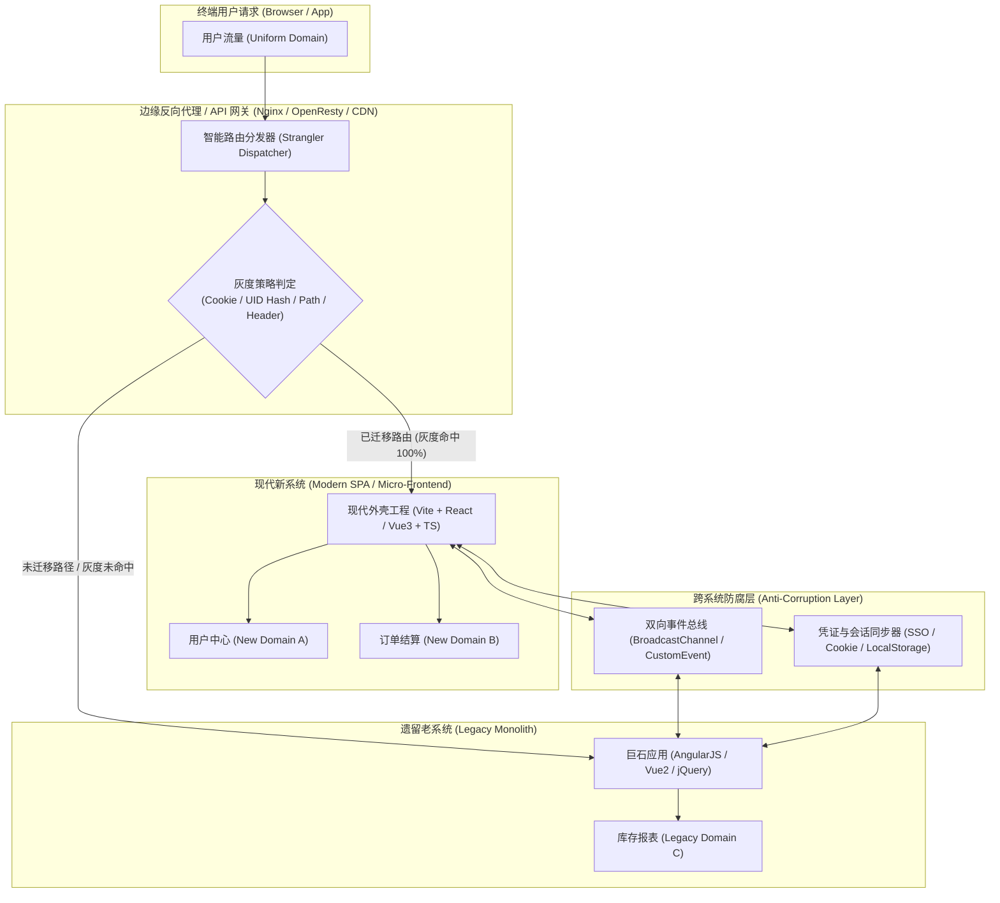
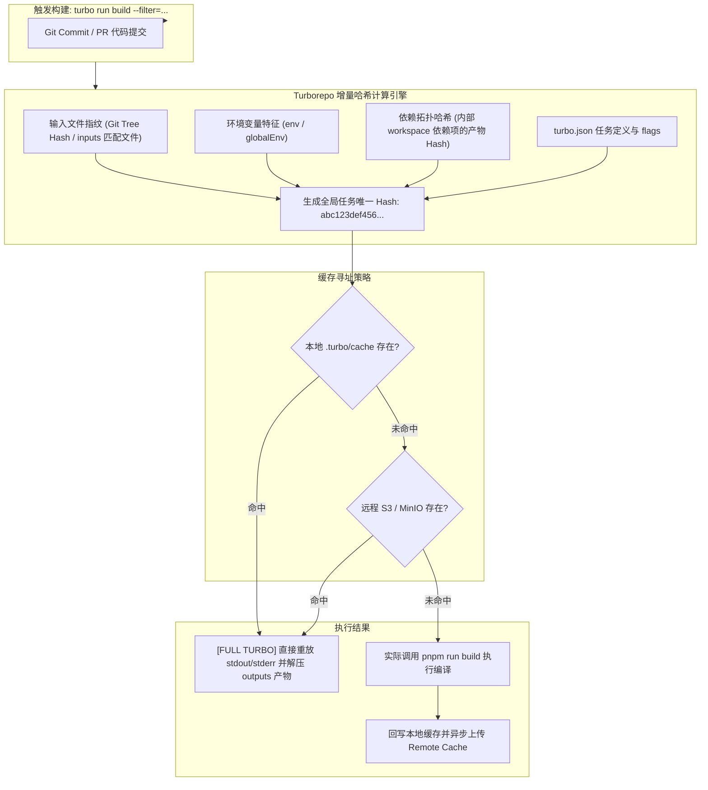
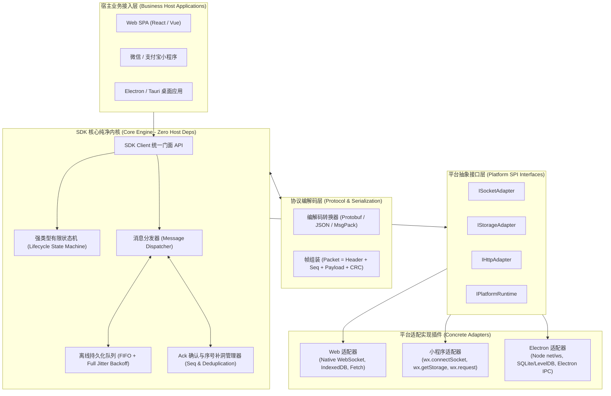
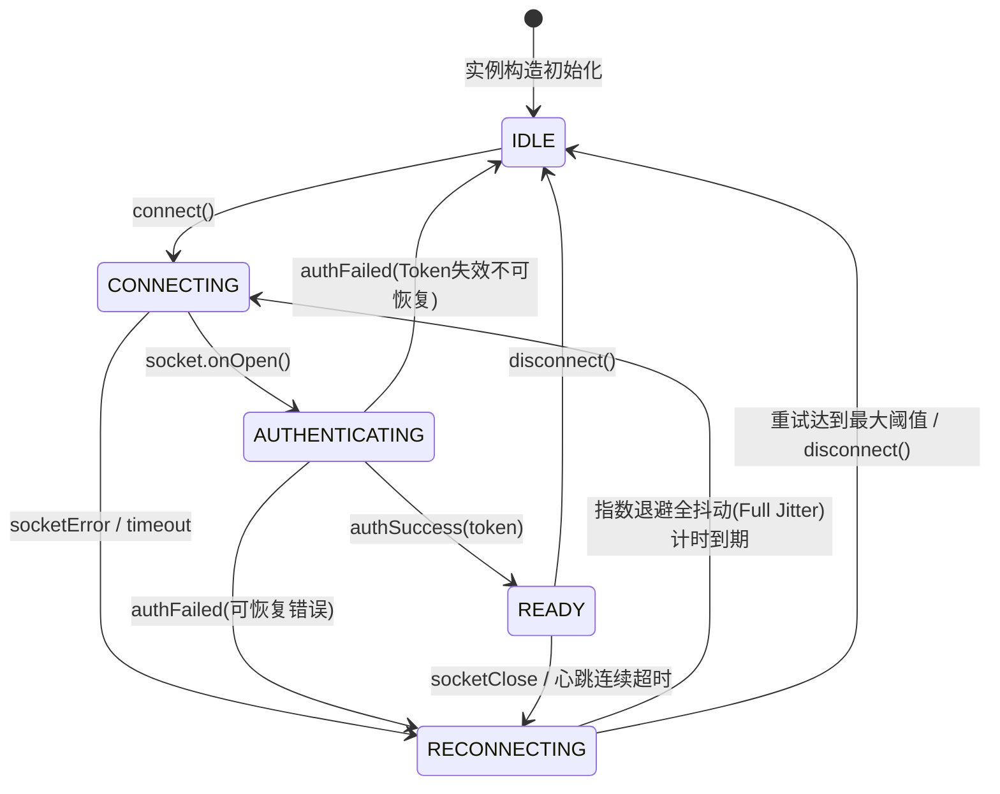
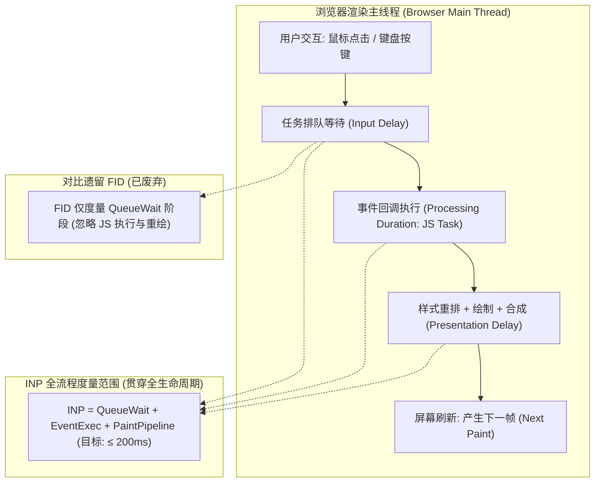

# 前端系统设计 · 现代架构与核心战役✅

import sdkFsmHtml from '!!raw-loader!./answers/p0-cross-platform-sdk-architecture/index.html'

本章节收录现代前端架构领域的四大深水区战役级系统设计题，涵盖大型遗留系统渐进式绞杀重构、Monorepo 依赖与增量构建治理、跨平台统一 SDK 分层与状态收敛，以及基于 Core Web Vitals (CWV) / INP / LoAF 的全链路性能监控与归因体系。

---

## 大型超万行前端遗留系统（Legacy）架构腐化治理与渐进式重构（Strangler Fig 绞杀者模式）实战？ {#p0-legacy-refactor-strangler}

<Answer>

### 核心结论

面对规模超数十万行、业务逻辑错综复杂的超大型前端遗留系统（如历史技术栈 AngularJS / jQuery / Vue 2 / 早期 Webpack 多页与单页混杂应用），**推倒重来（Big Bang Rewrite）往往是致命陷阱**——它不仅面临业务交付停滞、隐含业务知识断代丢失、新老系统双线同步维护成本倍增的巨大风险，更极易因项目延期陷入恶性循环。

业界顶尖的前端架构治理范式是采用 Martin Fowler 提出的 **绞杀者植物模式（Strangler Fig Pattern）**：
1. **外围包裹与边缘分流**：通过边缘网关（Nginx / OpenResty / Cloudflare Workers）或统一前端反向代理层，在老系统外围构建拦截与分流屏障。
2. **渐进式同构共存**：新架构（基于 Vite / React 19 / Vue 3 / TypeScript）作为主体吸纳新业务，旧系统按业务领域上下文（Bounded Context）逐级拆解，通过微前端/跨应用防腐层（Anti-Corruption Layer, ACL）与双向通信总线桥接会话与状态，实现新老系统同一域名下的无缝共存。
3. **逐域绞杀与平滑退役**：通过基于用户画像/哈希权重的百分比灰度切流机制，从边缘业务到核心业务逐步切量，老系统功能被逐步“绞杀”萎缩，最终在业务零停机、用户零感知的前提下实现老系统的物理下线。
4. **棘轮防劣化工程（Ratchet Mechanism）**：配套圈复杂度门禁、依赖防腐隔离规范与双轨自动化回归测试，确保重构过程“只进不退”。

---

### 原理解析与架构设计

<StranglerVisualizer />

#### 1. 架构腐化根因与重构全景图

遗留系统腐化的根源通常呈现五大特征：**全局作用域污染与隐式依赖**、**巨石组件（God Component, 单文件数千行）**、**数据流双向蔓延且无单点真理源**、**自动化测试防护网缺失（回归全凭人工）**，以及**第三方库版本断代锁定**。

绞杀者模式的生命周期遵循 **Transform（改造） -> Coexist（共存） -> Eliminate（消亡）** 三步曲：



#### 2. 路由分流与边缘反向代理策略

实现零停机与渐进替换的关键在于**反向代理层的多维分发**。边缘层（如 Nginx / OpenResty）根据三种路由策略协同工作：
- **基于路径的分流（Path-Based Routing）**：将重构完毕的完整二级路由直接重定向至新系统服务，老路由兜底代理至遗留集群。
- **基于用户特征的灰度分流（Feature Flag / Canary Routing）**：在相同 URL 路径下，通过提取客户端 Cookie、Token 或自定义 Header（如 `X-User-Id`），计算哈希值（`Hash(UID) % 100`），将特定比例流量引向新系统，其余保持老系统。
- **双向一键熔断与回退（Emergency Fallback）**：当新系统上报错误率突破阈值时，网关动态将切流权重置为 0，瞬时回滚至老系统。

#### 3. 跨应用通信与防腐层（Anti-Corruption Layer, ACL）

在共存阶段，新老系统往往存在跨子域的交互（例如新订单页需要调用老系统的全局购物车状态，或者老系统的登录态变化需同步至新容器）。若直接让新系统依赖老系统的全局变量（如 `window.legacyGlobals`），会导致新架构瞬间被污染。

**防腐层的设计要点**：
- **统一通信协议**：基于 `CustomEvent`、`BroadcastChannel` 或 `window.postMessage` 构建强类型事件总线。
- **适配器与数据清洗**：ACL 负责将老系统的脏数据结构（如无类型、不规则下划线命名）清洗为符合新系统 Domain Model 的强类型对象。
- **生命周期与内存防漏**：在跨微应用挂载/卸载时，严格注销所有监听器与跨域信道，杜绝闭包泄漏。

#### 4. 架构度量体系与防劣化棘轮机制

重构绝不能仅凭主观感觉，必须建立客观的**度量防护网（Quality Gates）**：
- **圈复杂度（Cyclomatic Complexity, CC）**：规定新增与修改函数的圈复杂度上限 ≤ 10（超过 15 强制 CI 阻断）。
- **认知复杂度（Cognitive Complexity）**：度量代码的实际可读性与嵌套深度。
- **依赖拓扑图与循环引用分析**：利用工具（如 Madge / Dependency-Cruiser）对模块依赖进行拓扑排序，严禁跨域循环依赖与反向引用。
- **棘轮机制（Ratchet Principle）**：在 CI 流水线中记录全量代码的坏味道总数，任何新提交必须满足“坏味道总量只降不升，单测覆盖率只增不减”。

---

### 生产级 TypeScript 架构实现代码

#### 1. 跨系统通信防腐层桥接器（AntiCorruptionBridge.ts）

```typescript
/**
 * 跨新老系统通信契约与防腐层实现
 * 封装跨窗口/跨微应用通信细节，提供强类型校验、响应式超时与内存防护
 */

export interface EventContract<T = unknown> {
  type: string
  payload: T
  source: 'LEGACY_APP' | 'MODERN_APP'
  timestamp: number
  correlationId: string
}

export type EventHandler<T> = (payload: T, event: EventContract<T>) => void

export class AntiCorruptionBridge {
  private static instance: AntiCorruptionBridge | null = null
  private channel: BroadcastChannel | null = null
  private listeners: Map<string, Set<EventHandler<any>>> = new Map()
  private pendingRequests: Map<
    string,
    { resolve: (value: any) => void; reject: (reason: any) => void; timer: ReturnType<typeof setTimeout> }
  > = new Map()

  private constructor(private readonly channelName: string = 'app_strangler_channel') {
    if (typeof window !== 'undefined' && 'BroadcastChannel' in window) {
      this.channel = new BroadcastChannel(this.channelName)
      this.channel.onmessage = (event: MessageEvent<EventContract>) => {
        this.dispatch(event.data)
      }
    } else if (typeof window !== 'undefined') {
      // 降级使用 window.addEventListener('message')
      window.addEventListener('message', this.handleWindowMessage)
    }
  }

  public static getInstance(): AntiCorruptionBridge {
    if (!AntiCorruptionBridge.instance) {
      AntiCorruptionBridge.instance = new AntiCorruptionBridge()
    }
    return AntiCorruptionBridge.instance
  }

  private handleWindowMessage = (event: MessageEvent): void => {
    if (event.data && typeof event.data === 'object' && event.data.__strangler_bridge__) {
      this.dispatch(event.data.payload as EventContract)
    }
  }

  private dispatch(eventData: EventContract): void {
    if (!eventData || !eventData.type) return

    // 处理 RPC-Style 响应
    if (eventData.type.endsWith('_RESPONSE') && this.pendingRequests.has(eventData.correlationId)) {
      const pending = this.pendingRequests.get(eventData.correlationId)!
      clearTimeout(pending.timer)
      this.pendingRequests.delete(eventData.correlationId)
      pending.resolve(eventData.payload)
      return
    }

    // 处理常规事件订阅
    const handlers = this.listeners.get(eventData.type)
    if (handlers) {
      handlers.forEach((handler) => {
        try {
          handler(eventData.payload, eventData)
        } catch (err) {
          console.error(`[ACL Bridge Error] Handler failed for event ${eventData.type}:`, err)
        }
      })
    }
  }

  /**
   * 发布事件至全系统（新老应用共享）
   */
  public emit<T>(type: string, payload: T, source: 'LEGACY_APP' | 'MODERN_APP'): void {
    const event: EventContract<T> = {
      type,
      payload,
      source,
      timestamp: Date.now(),
      correlationId: `${source}_${Date.now()}_${Math.random().toString(36).substring(2, 9)}`
    }

    if (this.channel) {
      this.channel.postMessage(event)
    } else if (typeof window !== 'undefined') {
      window.postMessage({ __strangler_bridge__: true, payload: event }, '*')
    }

    // 同步触发当前环境内的监听
    this.dispatch(event)
  }

  /**
   * 订阅指定事件
   */
  public on<T>(type: string, handler: EventHandler<T>): () => void {
    if (!this.listeners.has(type)) {
      this.listeners.set(type, new Set())
    }
    this.listeners.get(type)!.add(handler)

    // 返回解绑函数，防止内存泄漏
    return () => {
      const handlers = this.listeners.get(type)
      if (handlers) {
        handlers.delete(handler)
        if (handlers.size === 0) {
          this.listeners.delete(type)
        }
      }
    }
  }

  /**
   * 请求-响应模式（RPC 调用老系统遗留服务）
   */
  public request<TRequest, TResponse>(
    type: string,
    payload: TRequest,
    source: 'LEGACY_APP' | 'MODERN_APP',
    timeoutMs: number = 3000
  ): Promise<TResponse> {
    const correlationId = `req_${Date.now()}_${Math.random().toString(36).substring(2, 9)}`
    const requestEvent: EventContract<TRequest> = {
      type,
      payload,
      source,
      timestamp: Date.now(),
      correlationId
    }

    return new Promise((resolve, reject) => {
      const timer = setTimeout(() => {
        this.pendingRequests.delete(correlationId)
        reject(new Error(`[ACL Bridge Timeout] Request ${type} timed out after ${timeoutMs}ms`))
      }, timeoutMs)

      this.pendingRequests.set(correlationId, { resolve, reject, timer })

      if (this.channel) {
        this.channel.postMessage(requestEvent)
      } else if (typeof window !== 'undefined') {
        window.postMessage({ __strangler_bridge__: true, payload: requestEvent }, '*')
      }
    })
  }

  public destroy(): void {
    if (this.channel) {
      this.channel.close()
      this.channel = null
    }
    if (typeof window !== 'undefined') {
      window.removeEventListener('message', this.handleWindowMessage)
    }
    this.listeners.clear()
    this.pendingRequests.forEach((p) => clearTimeout(p.timer))
    this.pendingRequests.clear()
    AntiCorruptionBridge.instance = null
  }
}
```

#### 2. 客户端/网关同构灰度分流器（StranglerRouteDispatcher.ts）

```typescript
/**
 * 绞杀者路由与灰度判定分发引擎
 * 支持基于 URL 路径、用户哈希权重桶及动态熔断回退
 */

export interface RouteRule {
  pathPattern: RegExp
  name: string
  rolloutPercentage: number // 0 ~ 100
  forceModernWhitelist?: string[] // UID 白名单
  emergencyLegacyFallback: boolean // 紧急熔断开关
}

export class StranglerRouteDispatcher {
  private rules: Map<string, RouteRule> = new Map()

  public registerRule(rule: RouteRule): void {
    this.rules.set(rule.name, rule)
  }

  /**
   * 基于 MurmurHash 思想的轻量级稳定整数哈希算法
   */
  private hashString(input: string): number {
    let hash = 0
    for (let i = 0; i < input.length; i++) {
      const char = input.charCodeAt(i)
      hash = (hash << 5) - hash + char
      hash |= 0 // 转换为 32 位有符号整数
    }
    return Math.abs(hash)
  }

  /**
   * 判定指定请求应命中新系统还是老系统
   * @param pathname 当前路径
   * @param userId 用户唯一标识
   */
  public shouldRouteToModern(pathname: string, userId?: string): boolean {
    for (const rule of this.rules.values()) {
      if (rule.pathPattern.test(pathname)) {
        // 1. 紧急熔断检查
        if (rule.emergencyLegacyFallback) {
          console.warn(`[Strangler Router] Route ${rule.name} triggered fallback to Legacy!`)
          return false
        }

        // 2. 白名单检查
        if (userId && rule.forceModernWhitelist?.includes(userId)) {
          return true
        }

        // 3. 100% 全量切流
        if (rule.rolloutPercentage >= 100) {
          return true
        }

        // 4. 0% 切流
        if (rule.rolloutPercentage <= 0) {
          return false
        }

        // 5. 基于用户 UID 哈希进行百分比分流
        const seed = userId || (typeof window !== 'undefined' ? window.navigator.userAgent : 'anonymous')
        const bucket = this.hashString(`${rule.name}:${seed}`) % 100
        return bucket < rule.rolloutPercentage
      }
    }

    // 默认兜底留在老系统
    return false
  }
}
```

#### 3. 架构防劣化：CI 圈复杂度与坏味道门禁检查脚本（ComplexityAuditor.ts）

```typescript
/**
 * 架构防劣化门禁脚本
 * 在 Git pre-commit 或 CI 流水线中解析变更代码，检测圈复杂度与巨石函数
 */

export interface ComplexityResult {
  functionName: string
  complexity: number
  line: number
  isViolation: boolean
}

export class ComplexityAuditor {
  private readonly MAX_CYCLOMATIC_COMPLEXITY = 10

  /**
   * 简化的词法/语法规则圈复杂度统计（控制流分支点加权）
   */
  public evaluateCode(sourceCode: string): ComplexityResult[] {
    const lines = sourceCode.split('\n')
    const results: ComplexityResult[] = []

    // 匹配函数定义
    const fnRegex = /(?:function\s+([a-zA-Z0-9_$]+)|([a-zA-Z0-9_$]+)\s*=\s*(?:async\s*)?\([^)]*\)\s*=>)/g
    // 匹配圈复杂度判定分支关键 token
    const branchRegex = /\b(if|else\s+if|for|while|case|catch)\b|\?|&&|\|\|/g

    let currentFunction = 'anonymous'
    let currentComplexity = 1
    let functionStartLine = 1

    lines.forEach((lineText, idx) => {
      const lineNum = idx + 1
      const fnMatch = fnRegex.exec(lineText)
      if (fnMatch) {
        if (currentComplexity > 1) {
          results.push({
            functionName: currentFunction,
            complexity: currentComplexity,
            line: functionStartLine,
            isViolation: currentComplexity > this.MAX_CYCLOMATIC_COMPLEXITY
          })
        }
        currentFunction = fnMatch[1] || fnMatch[2] || 'anonymous'
        currentComplexity = 1
        functionStartLine = lineNum
      }

      const branchMatches = lineText.match(branchRegex)
      if (branchMatches) {
        currentComplexity += branchMatches.length
      }
    })

    if (currentComplexity > 1) {
      results.push({
        functionName: currentFunction,
        complexity: currentComplexity,
        line: functionStartLine,
        isViolation: currentComplexity > this.MAX_CYCLOMATIC_COMPLEXITY
      })
    }

    return results
  }

  public runEnforcement(sourceCode: string): void {
    const violations = this.evaluateCode(sourceCode).filter((item) => item.isViolation)
    if (violations.length > 0) {
      const errorMsg = violations
        .map((v) => `Line ${v.line}: Function '${v.functionName}' cyclomatic complexity is ${v.complexity} (Limit: ${this.MAX_CYCLOMATIC_COMPLEXITY})`)
        .join('\n')
      throw new Error(`[Architecture Gate Blocked] Cognitive/Cyclomatic threshold exceeded:\n${errorMsg}`)
    }
  }
}
```

---

### 面试官视角与延伸阅读

**面试官核心考察点：**
1. **系统全局观与商业敏感度**：候选人是否能理性拒绝盲目“推倒重来”，讲清楚推倒重来对业务连续性、组织协同和商业风险的负面影响，并清晰阐述绞杀者模式的核心生命周期。
2. **边缘网络与灰度工程设计**：能否清晰设计基于 Nginx / BFF 层的多级分流逻辑，包括路径匹配、Cookie/UID 一致性哈希分流与秒级灾备熔断机制。
3. **跨系统解耦实践经验**：是否具备真实处理过巨石架构中全局状态泄露、CSS 作用域冲突、Token 免登无缝桥接的实际经验，能否设计出标准的防腐层（ACL）。
4. **度量体系与持续防劣化闭环**：是否具备工程化领导力，能将重构从“个人技术行为”上升为“流水线制度保障”（SonarQube 门禁、圈复杂度限制、单测覆盖率只增不减的棘轮效应）。

**延伸阅读：**
- Martin Fowler: *Strangler Fig Application* (2004/2020)
- Eric Evans: *Domain-Driven Design: Tackling Complexity in the Heart of Software* (防腐层与界限上下文)
- Michael Feathers: *Working Effectively with Legacy Code* (修改代码的艺术与接缝理论)

</Answer>

---

## 大型前端 Monorepo 工程体系选型与依赖治理（pnpm workspace + Turborepo 增量缓存与 CI/CD 影响分析）？ {#p0-monorepo-governance-turborepo}

<Answer>

### 核心结论

在多团队协同、跨业务线模块复用及大规模前端工程场景下，**多代码库（Multi-repo）模式必然暴露出跨仓库修改成本高（多处 PR 提交）、依赖版本碎片化与版本漂移（Version Drift）、工具链配置割裂与调试联动困难等结构性瓶颈**。现代前端工程的最佳解法是迁移至 **Monorepo（单体多包代码库）**。

构建高效 Monorepo 体系的黄金组合为 **pnpm workspace + Turborepo**：
1. **包管理底层（pnpm workspace）**：利用**全局内容寻址存储（CAS）与基于硬链接（Hard Links）+ 符号链接（Symlinks）的拓扑隔离结构**，彻底终结了 npm/yarn v1 扁平化目录带来的**幽灵依赖（Phantom Dependencies）**与**依赖分身（Doppelgangers）**问题，大幅缩减本地与 CI 磁盘占用。
2. **任务调度与缓存引擎（Turborepo）**：将构建、校验、测试任务抽象为**有向无环图（Task DAG）**。通过严谨计算任务输入（Inputs Files Hash）、环境变量指纹与依赖包拓扑哈希，结合**本地缓存与远程缓存（Remote Cache）**，实现任务的近瞬间恢复（`>>> FULL TURBO`），使 CI 时间成倍缩减。
3. **依赖一致性管控（Catalog / Syncpack）**：利用 pnpm 9+ 原生 **Catalogs** 特性集中锁定全局公共依赖版本，配合 `pnpm.peerDependencyRules` 消除 Peer 依赖漂移。
4. **精准增量交付（Affected Filtering）**：在 CI/CD 中通过 Git Diff 拓扑分析，仅对受当前 PR/Commit 影响的受影响包（Affected Packages）执行构建和测试，驱动高效发包（Changesets）与流水线并行矩阵化。

---

### 原理解析与架构设计

#### 1. pnpm 软硬链接拓扑原理 vs 传统幽灵依赖

传统 npm/yarn 的扁平化（Flat node_modules）处理方式存在致命隐患：
- **幽灵依赖（Phantom Dependencies）**：A 依赖 B，B 依赖 C。扁平化后 C 被直接提升到根目录 `node_modules/C`。A 的源码即便未在 `package.json` 声明 C，也可以直接 `import C from 'c'`。当未来 B 升级移除了对 C 的依赖时，A 将在生产环境因运行时找不到模块而崩溃。
- **依赖分身（Doppelgangers）**：同一个库的不同次要版本无法同时提升，导致重复下载并占用数倍体积，甚至破坏单例模式（如多份 React 实例导致 Hooks 报错）。

pnpm 的设计哲学为**严格非扁平与全局复用**：
```
<workspace-root>/
  ├── .pnpm-store/                   # 全局 CAS (Content-Addressable Store) 内容寻址中心
  ├── packages/
  │   └── app-a/
  │       └── node_modules/
  │           ├── .pnpm/             # 隔离虚拟目录 (以 package@version 命名)
  │           │   ├── bar@1.0.0/
  │           │   │   └── node_modules/
  │           │   │       ├── bar/   <== 硬链接自全局 store
  │           │   └── foo@1.0.0/
  │           │       └── node_modules/
  │           │           └── foo/   <== 硬链接自全局 store
  │           └── foo/               <== 顶级仅有实际声明的依赖 (软链接指向 .pnpm/foo@1.0.0/...)
```
通过上述结构，未在 `package.json` 声明的依赖项无法被 `app-a` 直接访问，根除了幽灵依赖。

#### 2. Turborepo 哈希管线计算模型与 Remote Cache

Turborepo 的核心是**任务哈希判定管线**。对任意任务（如 `turbo run build`），其计算指纹的哈希模型抽象为：

```text
TaskHash = SHA256(PackageHash + InputsHash + EnvVarsHash + TaskConfigHash + DependencyOutputsHash)
```



#### 3. 依赖一致性治理：pnpm Catalogs 架构

大型 Monorepo 往往包含数十甚至上百个子包，极易出现 `packages/web` 使用 `vue@3.4.1`，而 `packages/admin` 使用 `vue@3.5.2` 的混乱状况。
pnpm 9+ 引入了原生 **Catalogs（依赖目录中心）**：
- 在 `pnpm-workspace.yaml` 中统一定义版本号。
- 各子包统一声明形如 `"vue": "catalog:"` 或 `"typescript": "catalog:toolchain"`。
- 一处升级，全局生效，彻底杜绝版本漂移。

#### 4. Affected 增量分析与流水线矩阵设计

在 CI 环境中，如果每次修改微小工具函数都要全量构建整个 Monorepo，CI 队列将迅速拥堵。利用 Turborepo 的 `--filter=...[origin/main]`，可以计算当前分支相较于主干的差异图元：
- 语法 `...[origin/main]`：表示变更包**以及所有依赖这些包的下游消费者（Consumers）**必须被重新测试与构建。
- 语法 `[origin/main]...`：表示变更包及其所有上游依赖包。

---

### 生产级 TypeScript 与配置实战

#### 1. 生产级 `pnpm-workspace.yaml` 与 Catalogs 配置

```yaml
packages:
  - 'apps/*'
  - 'packages/*'
  - 'shared/*'
  - 'tooling/*'

# pnpm 9+ 依赖集中管控目录
catalog:
  react: ^19.0.0
  react-dom: ^19.0.0
  typescript: ~5.6.2
  zod: ^3.23.8

catalogs:
  build-tools:
    vite: ^5.4.8
    vitest: ^2.1.1
    eslint: ^9.11.1
    unbuild: ^2.0.0
  network:
    axios: ^1.7.7

# 治理依赖冲突规则
packageExtensions:
  some-legacy-pkg:
    peerDependencies:
      react: '^18.0.0 || ^19.0.0'

peerDependencyRules:
  ignoreMissing:
    - '@types/react'
  allowAny:
    - 'eslint'
```

#### 2. 生产级 `turbo.json` 任务依赖编排与缓存指纹

```json
{
  "$schema": "https://turbo.build/schema.json",
  "globalDependencies": ["**/.env.*local", "tsconfig.base.json"],
  "globalEnv": ["NODE_ENV", "CI", "APP_ENV"],
  "tasks": {
    "topo:build": {
      "dependsOn": ["^topo:build"],
      "outputs": ["dist/**", ".next/**", "!.next/cache/**"],
      "inputs": ["src/**", "package.json", "tsconfig.json"]
    },
    "build": {
      "dependsOn": ["^build"],
      "outputs": ["dist/**", "build/**"],
      "inputs": ["src/**", "public/**", "package.json", "tsconfig.json", "vite.config.ts"]
    },
    "test": {
      "dependsOn": ["build"],
      "outputs": ["coverage/**"],
      "inputs": ["src/**", "test/**", "**/*.test.ts"],
      "env": ["VITEST_ENV"]
    },
    "lint": {
      "outputs": [],
      "inputs": ["src/**", ".eslintrc.*", "eslint.config.*"]
    },
    "dev": {
      "cache": false,
      "persistent": true
    }
  }
}
```

#### 3. Monorepo 依赖漂移与幽灵依赖检查工具（MonorepoDependencyAuditor.ts）

```typescript
/**
 * Monorepo 依赖一致性与拓扑循环巡检脚本
 * 深度解析 Workspace 间依赖版本漂移、隐式循环引用
 */

import * as fs from 'fs'
import * as path from 'path'

export interface PackageMeta {
  name: string
  dirPath: string
  dependencies: Record<string, string>
  devDependencies: Record<string, string>
}

export interface DriftReport {
  depName: string
  versions: Record<string, string[]> // version -> package names[]
}

export class MonorepoDependencyAuditor {
  private packages: Map<string, PackageMeta> = new Map()

  public scanWorkspace(packagesRootDir: string[]): void {
    for (const rootDir of packagesRootDir) {
      if (!fs.existsSync(rootDir)) continue
      const entries = fs.readdirSync(rootDir, { withFileTypes: true })
      for (const entry of entries) {
        if (entry.isDirectory()) {
          const pkgJsonPath = path.join(rootDir, entry.name, 'package.json')
          if (fs.existsSync(pkgJsonPath)) {
            const rawContent = JSON.parse(fs.readFileSync(pkgJsonPath, 'utf-8'))
            this.packages.set(rawContent.name, {
              name: rawContent.name,
              dirPath: path.join(rootDir, entry.name),
              dependencies: rawContent.dependencies || {},
              devDependencies: rawContent.devDependencies || {}
            })
          }
        }
      }
    }
  }

  /**
   * 检查三方依赖版本漂移
   */
  public findVersionDrifts(): DriftReport[] {
    const depMap: Map<string, Map<string, string[]>> = new Map()

    for (const pkg of this.packages.values()) {
      const allDeps = { ...pkg.dependencies, ...pkg.devDependencies }
      for (const [dep, ver] of Object.entries(allDeps)) {
        if (ver.startsWith('workspace:')) continue // 忽略内部互相引用

        if (!depMap.has(dep)) {
          depMap.set(dep, new Map())
        }
        const verGroup = depMap.get(dep)!
        if (!verGroup.has(ver)) {
          verGroup.set(ver, [])
        }
        verGroup.get(ver)!.push(pkg.name)
      }
    }

    const reports: DriftReport[] = []
    for (const [depName, verGroup] of depMap.entries()) {
      if (verGroup.size > 1) {
        const versions: Record<string, string[]> = {}
        for (const [ver, pkgs] of verGroup.entries()) {
          versions[ver] = pkgs
        }
        reports.push({ depName, versions })
      }
    }

    return reports
  }

  /**
   * 检查内部 Workspace 之间的循环依赖（DFS 环检测）
   */
  public detectCircularDependencies(): string[][] {
    const adjList: Map<string, string[]> = new Map()
    const allInternalPkgs = new Set(this.packages.keys())

    // 建立图结构
    for (const [pkgName, meta] of this.packages.entries()) {
      const internalDeps: string[] = []
      const deps = { ...meta.dependencies, ...meta.devDependencies }
      for (const dep of Object.keys(deps)) {
        if (allInternalPkgs.has(dep)) {
          internalDeps.push(dep)
        }
      }
      adjList.set(pkgName, internalDeps)
    }

    const visited = new Set<string>()
    const inStack = new Set<string>()
    const cycles: string[][] = []

    const dfs = (node: string, currentPath: string[]): void => {
      visited.add(node)
      inStack.add(node)
      currentPath.push(node)

      const neighbors = adjList.get(node) || []
      for (const neighbor of neighbors) {
        if (!visited.has(neighbor)) {
          dfs(neighbor, currentPath)
        } else if (inStack.has(neighbor)) {
          const cycleStartIndex = currentPath.indexOf(neighbor)
          cycles.push(currentPath.slice(cycleStartIndex).concat(neighbor))
        }
      }

      currentPath.pop()
      inStack.delete(node)
    }

    for (const node of this.packages.keys()) {
      if (!visited.has(node)) {
        dfs(node, [])
      }
    }

    return cycles
  }
}
```

#### 4. GitHub Actions 高性能增量 CI 流水线示例

```yaml
name: Monorepo Accelerated CI

on:
  pull_request:
    branches: [main]
  push:
    branches: [main]

env:
  TURBO_TOKEN: ${{ secrets.TURBO_SERVER_TOKEN }}
  TURBO_API: ${{ vars.TURBO_REMOTE_CACHE_ENDPOINT }}

jobs:
  affected-build-and-test:
    runs-on: ubuntu-latest
    steps:
      - name: Checkout Code
        uses: actions/checkout@v4
        with:
          fetch-depth: 0 # 获取完整 Git 历史供 Turborepo 计算 Diff

      - name: Install pnpm
        uses: pnpm/action-setup@v3
        with:
          version: 9.11.0

      - name: Setup Node.js Environment
        uses: actions/setup-node@v4
        with:
          node-version: 20.x
          cache: 'pnpm'

      - name: Install Dependencies
        run: pnpm install --frozen-lockfile

      - name: Run Architecture & Dependency Audit
        run: pnpm run audit:deps

      - name: Turbo Build (Affected Only)
        run: pnpm exec turbo run build --filter=...[origin/main]

      - name: Turbo Test (Affected Only)
        run: pnpm exec turbo run test --filter=...[origin/main] --concurrency=4
```

---

### 面试官视角与延伸阅读

**面试官核心考察点：**
1. **包管理底层机理**：是否清楚 pnpm 的 CAS、硬链接与软链接寻址模型，能否深入剖析幽灵依赖（Phantom Dependencies）与依赖分身（Doppelgangers）的产生根源与解决方案。
2. **构建缓存与哈希确定性**：能否准确讲出 Turborepo 任务指纹的计算要素，如何配置 inputs、outputs 与 env 防止缓存中毒（Cache Poisoning）或缓存击穿。
3. **规模化协作痛点与解法**：在百人规模团队中，如何治理多包版本冲突？是否实践过 Catalogs、Changesets 语义化多包自动发版，以及基于 Affected 的精准增量 CI。
4. **CI/CD 效能权衡**：如何通过 Remote Cache 跨机器/跨开发者共享产物，如何处理缓存传输耗时与本地编译耗时的收益边界。

**延伸阅读：**
- pnpm Official Docs: *Symlinked node_modules structure & Catalogs*
- Vercel Turborepo Architecture: *Core Concepts & Task Pipeline Graphs*
- Changesets: *Automated SemVer Management in Monorepos*

</Answer>

---

## 跨 Web / 小程序 / 桌面端一套代码多端统一 SDK 分层架构设计与多端状态一致性保障？ {#p0-cross-platform-sdk-architecture}

<Answer>

### 核心结论

跨 Web（PC/H5）、小程序（微信/支付宝）、桌面端（Electron / Tauri）统一 SDK（如即时通讯 IM、音视频信令、端监控埋点 SDK）的研发最容易沦为灾难——**若在代码中充斥大量 `if (isWechat) { wx.xxx } else if (isElectron) { ... }`，系统将迅速失控，导致平台逻辑与核心业务紧密耦合、单测不可运行、新平台接入寸步难行**。

打造工业级跨端 SDK 必须贯彻 **“内核极简、依赖倒置（DIP）、单向流驱动与有限状态机（FSM）严格收敛”** 的四大核心设计原则：
1. **纯净 Core 内核层**：基于原生 TypeScript，完全不包含任何浏览器宿主或小程序全局 API。仅承载核心领域模型、有限状态机（FSM）、调度引擎与重试防抖逻辑。
2. **平台能力抽象（Platform SPI / Adapter Pattern）**：定义一组极简但完备的强类型底层契约接口（`ISocketAdapter`、`IStorageAdapter`、`IHttpAdapter`、`IPlatformRuntime`），各端平台作为可插拔插件在运行时或构建打包期完成动态注入。
3. **协议与序列化层（Protocol）**：支持 Protobuf 二进制 / JSON 序列化、分包拆包、帧流水号递增（Seq）与报文完整性校验。
4. **状态一致性与离线韧性机制**：端侧状态由状态机（FSM）做原子跃迁守卫；对于弱网或离线场景，依托**端侧落盘离线队列（FIFO）+ 指数退避与全抖动重连（Full Jitter Backoff）+ 双向 Ack 确认与序号补洞机制**，确保跨端断线重连后的数据绝对不丢、不重、最终一致。

---

### 原理解析与架构设计

#### 1. 统一 SDK 三层架构全景图



#### 2. 有限状态机（FSM）生命周期收敛模型

网络 SDK 最大的痛点是**竞态条件（Race Conditions）**——例如在连接正在建立时（`CONNECTING`）用户主动调用了断开，紧接着底层 socket 触发了 `onOpen` 回调，极易导致“连接已断开但状态仍显示已连接”的幽灵状态。

引入严格的有限状态机，定义合法的跃迁转移矩阵，任何非法跃迁将被拒绝并报警：



#### 3. 跨端 SDK 状态跃迁与离线队列冲刷交互实测

下面是基于上述状态机与离线缓冲队列机制构建的可运行真实沙盒，可在线模拟断网、业务调用拦截入队、网络恢复与队列自动冲刷全流程：

<CustomSandPack 
  template="static" 
  files={{
    "/index.html": sdkFsmHtml
  }} 
  options={{ 
    editorHeight: 450,
    showTabs: false
  }} 
/>

#### 4. 弱网韧性保障：指数退避与随机全抖动（Full Jitter）

在网络抖动或服务端崩溃重启时，数万端侧 SDK 同时重连会形成恐怖的**连接雪崩（Thundering Herd / Avalanche）**。
标准的指数退避公式若无随机扰动，仍会导致端侧在完全一致的时刻重试。必须采用 AWS 推荐的 **Full Jitter（全抖动）重连退避算法**：

```text
T_sleep = random(0, min(T_max, T_base * 2^attempt))
```

该算法在保证指数级拉长重连间隔的同时，将全体客户端重试请求均匀打散在时间轴上，保护后端网关。

#### 5. 离线消息队列与多端落盘收敛

- **入队策略**：当 FSM 状态处于非 `READY` 时，所有业务调用进入 `ResilientQueue`。
- **持久化分层**：优先缓存在内存，并异步触发 `IStorageAdapter.set()` 进行本地化持久化（Web 端降级为 IndexedDB / LocalStorage，小程序端走 `wx.setStorage`，桌面端可走 Local File / SQLite）。
- **去重与幂等（Idempotency）**：每条消息由客户端生成递增单调自增 `SeqId` + 全局唯一 `ClientMessageId`，服务端消费后返回包含对应 `SeqId` 的 Ack 包，端侧根据 Ack 释放队列项。

---

### 生产级 TypeScript 架构实现代码

#### 1. 跨平台 SPI 契约抽象（PlatformSPI.ts）

```typescript
/**
 * 平台宿主能力抽象接口定义 (SPI)
 * 纯契约层，不含任何平台实现
 */

export interface SocketEventListener {
  onOpen: () => void
  onMessage: (data: ArrayBuffer | string) => void
  onError: (error: Error) => void
  onClose: (code: number, reason: string) => void
}

export interface ISocketAdapter {
  connect(url: string, protocols?: string[]): Promise<void>
  send(data: ArrayBuffer | string): Promise<void>
  close(code?: number, reason?: string): Promise<void>
  registerEvents(listener: SocketEventListener): void
}

export interface IStorageAdapter {
  get<T>(key: string): Promise<T | null>
  set<T>(key: string, value: T): Promise<void>
  remove(key: string): Promise<void>
  clear(): Promise<void>
}

export interface IPlatformRuntime {
  getPlatformName(): 'web' | 'miniapp' | 'electron' | 'node'
  now(): number
}
```

#### 2. 强类型有限状态机引擎（StateMachine.ts）

```typescript
/**
 * 强类型有限状态机 (FSM)
 * 严格管理 SDK 连接生命周期，阻断非法状态跃迁与竞态
 */

export enum ConnectionState {
  IDLE = 'IDLE',
  CONNECTING = 'CONNECTING',
  AUTHENTICATING = 'AUTHENTICATING',
  READY = 'READY',
  RECONNECTING = 'RECONNECTING',
  CLOSED = 'CLOSED'
}

export enum ConnectionEvent {
  CONNECT_CALLED = 'CONNECT_CALLED',
  SOCKET_OPENED = 'SOCKET_OPENED',
  AUTH_SUCCESS = 'AUTH_SUCCESS',
  AUTH_FAILED = 'AUTH_FAILED',
  SOCKET_CLOSED = 'SOCKET_CLOSED',
  FATAL_ERROR = 'FATAL_ERROR',
  MANUAL_DISCONNECT = 'MANUAL_DISCONNECT'
}

export class StateMachine {
  private currentState: ConnectionState = ConnectionState.IDLE
  private readonly stateListeners: Set<(from: ConnectionState, to: ConnectionState) => void> = new Set()

  // 状态转移白名单矩阵 (Transition Matrix)
  private readonly transitions: Record<ConnectionState, Partial<Record<ConnectionEvent, ConnectionState>>> = {
    [ConnectionState.IDLE]: {
      [ConnectionEvent.CONNECT_CALLED]: ConnectionState.CONNECTING
    },
    [ConnectionState.CONNECTING]: {
      [ConnectionEvent.SOCKET_OPENED]: ConnectionState.AUTHENTICATING,
      [ConnectionEvent.SOCKET_CLOSED]: ConnectionState.RECONNECTING,
      [ConnectionEvent.MANUAL_DISCONNECT]: ConnectionState.CLOSED
    },
    [ConnectionState.AUTHENTICATING]: {
      [ConnectionEvent.AUTH_SUCCESS]: ConnectionState.READY,
      [ConnectionEvent.AUTH_FAILED]: ConnectionState.RECONNECTING,
      [ConnectionEvent.SOCKET_CLOSED]: ConnectionState.RECONNECTING,
      [ConnectionEvent.MANUAL_DISCONNECT]: ConnectionState.CLOSED
    },
    [ConnectionState.READY]: {
      [ConnectionEvent.SOCKET_CLOSED]: ConnectionState.RECONNECTING,
      [ConnectionEvent.MANUAL_DISCONNECT]: ConnectionState.CLOSED
    },
    [ConnectionState.RECONNECTING]: {
      [ConnectionEvent.CONNECT_CALLED]: ConnectionState.CONNECTING,
      [ConnectionEvent.MANUAL_DISCONNECT]: ConnectionState.CLOSED
    },
    [ConnectionState.CLOSED]: {
      [ConnectionEvent.CONNECT_CALLED]: ConnectionState.CONNECTING
    }
  }

  public getState(): ConnectionState {
    return this.currentState
  }

  public transition(event: ConnectionEvent): boolean {
    const allowedTargets = this.transitions[this.currentState]
    const nextState = allowedTargets ? allowedTargets[event] : undefined

    if (!nextState) {
      console.warn(`[FSM Guard] Blocked illegal transition: ${this.currentState} -> event: ${event}`)
      return false
    }

    const previousState = this.currentState
    this.currentState = nextState

    this.stateListeners.forEach((listener) => {
      try {
        listener(previousState, nextState)
      } catch (err) {
        console.error('[FSM Listener Error]:', err)
      }
    })

    return true
  }

  public onStateChange(listener: (from: ConnectionState, to: ConnectionState) => void): () => void {
    this.stateListeners.add(listener)
    return () => this.stateListeners.delete(listener)
  }
}
```

#### 3. 弹性离线持久化队列与全抖动重连（ResilientOfflineQueue.ts）

```typescript
/**
 * 离线队列与指数退避重试引擎
 * 支持断网落盘、全抖动退避重连与 Ack 确认
 */

import { IStorageAdapter } from './PlatformSPI'

export interface OutboundMessage<T = unknown> {
  id: string
  seq: number
  payload: T
  attempts: number
  timestamp: number
}

export class ResilientOfflineQueue {
  private queue: OutboundMessage[] = []
  private readonly STORAGE_KEY = '__sdk_offline_queue_cache__'
  private isProcessing = false

  constructor(
    private readonly storage: IStorageAdapter,
    private readonly maxQueueLength: number = 500
  ) {
    this.restoreFromStorage()
  }

  private async restoreFromStorage(): Promise<void> {
    try {
      const persisted = await this.storage.get<OutboundMessage[]>(this.STORAGE_KEY)
      if (Array.isArray(persisted) && persisted.length > 0) {
        this.queue = [...persisted, ...this.queue].slice(0, this.maxQueueLength)
      }
    } catch (e) {
      console.error('[OfflineQueue] Failed to hydrate queue from storage:', e)
    }
  }

  private async syncToStorage(): Promise<void> {
    try {
      await this.storage.set(this.STORAGE_KEY, this.queue)
    } catch (e) {
      console.error('[OfflineQueue] Failed to persist queue to storage:', e)
    }
  }

  public async enqueue(payload: unknown, seq: number): Promise<string> {
    const id = `msg_${Date.now()}_${Math.random().toString(36).substring(2, 9)}`
    const msg: OutboundMessage = {
      id,
      seq,
      payload,
      attempts: 0,
      timestamp: Date.now()
    }

    if (this.queue.length >= this.maxQueueLength) {
      // 队列溢出策略：淘汰最老的非核心消息
      this.queue.shift()
    }

    this.queue.push(msg)
    await this.syncToStorage()
    return id
  }

  public async acknowledge(messageId: string): Promise<void> {
    this.queue = this.queue.filter((item) => item.id !== messageId)
    await this.syncToStorage()
  }

  /**
   * AWS Full Jitter (全抖动) 退避时延计算
   */
  public calculateBackoff(attempt: number, baseMs = 500, maxMs = 30000): number {
    const exponentialBackoff = Math.min(maxMs, baseMs * Math.pow(2, attempt))
    // 在 0 ~ exponentialBackoff 之间随机取值
    return Math.floor(Math.random() * (exponentialBackoff + 1))
  }

  public async flush(sendFn: (msg: OutboundMessage) => Promise<boolean>): Promise<void> {
    if (this.isProcessing || this.queue.length === 0) return
    this.isProcessing = true

    const pendingList = [...this.queue]
    for (const msg of pendingList) {
      msg.attempts++
      try {
        const ok = await sendFn(msg)
        if (ok) {
          await this.acknowledge(msg.id)
        } else {
          // 发送失败中止本轮冲刷，等待下一次触发
          break
        }
      } catch (err) {
        console.warn(`[OfflineQueue] Send error for ${msg.id}:`, err)
        break
      }
    }

    this.isProcessing = false
  }

  public getPendingCount(): number {
    return this.queue.length
  }
}
```

#### 4. Web 端与微信小程序端 Socket 适配器实现示例

```typescript
import { ISocketAdapter, SocketEventListener } from './PlatformSPI'

/**
 * 标准 Web 端 WebSocket 适配器实现
 */
export class WebSocketAdapter implements ISocketAdapter {
  private ws: WebSocket | null = null
  private listener: SocketEventListener | null = null

  public registerEvents(listener: SocketEventListener): void {
    this.listener = listener
  }

  public connect(url: string, protocols?: string[]): Promise<void> {
    return new Promise((resolve, reject) => {
      try {
        this.ws = new WebSocket(url, protocols)
        this.ws.binaryType = 'arraybuffer'

        this.ws.onopen = () => {
          this.listener?.onOpen()
          resolve()
        }
        this.ws.onmessage = (event) => this.listener?.onMessage(event.data)
        this.ws.onerror = () => {
          const err = new Error('WebSocket connection error')
          this.listener?.onError(err)
          reject(err)
        }
        this.ws.onclose = (ev) => this.listener?.onClose(ev.code, ev.reason)
      } catch (e) {
        reject(e)
      }
    })
  }

  public send(data: ArrayBuffer | string): Promise<void> {
    if (!this.ws || this.ws.readyState !== WebSocket.OPEN) {
      return Promise.reject(new Error('WebSocket is not ready'))
    }
    this.ws.send(data)
    return Promise.resolve()
  }

  public close(code = 1000, reason = 'Normal Closure'): Promise<void> {
    if (this.ws) {
      this.ws.close(code, reason)
      this.ws = null
    }
    return Promise.resolve()
  }
}

/**
 * 微信小程序适配器实现声明
 */
declare const wx: any

export class WechatMiniAppSocketAdapter implements ISocketAdapter {
  private task: any = null
  private listener: SocketEventListener | null = null

  public registerEvents(listener: SocketEventListener): void {
    this.listener = listener
  }

  public connect(url: string, protocols?: string[]): Promise<void> {
    return new Promise((resolve, reject) => {
      this.task = wx.connectSocket({
        url,
        protocols,
        success: () => resolve(),
        fail: (err: any) => reject(new Error(err.errMsg || 'wx connect failed'))
      })

      this.task.onOpen(() => this.listener?.onOpen())
      this.task.onMessage((res: any) => this.listener?.onMessage(res.data))
      this.task.onError((res: any) => this.listener?.onError(new Error(res.errMsg)))
      this.task.onClose((res: any) => this.listener?.onClose(res.code, res.reason))
    })
  }

  public send(data: ArrayBuffer | string): Promise<void> {
    return new Promise((resolve, reject) => {
      if (!this.task) return reject(new Error('wx socket not initialized'))
      this.task.send({
        data,
        success: () => resolve(),
        fail: (err: any) => reject(new Error(err.errMsg))
      })
    })
  }

  public close(code = 1000, reason = 'Normal Closure'): Promise<void> {
    return new Promise((resolve) => {
      if (this.task) {
        this.task.close({ code, reason, complete: () => resolve() })
        this.task = null
      } else {
        resolve()
      }
    })
  }
}
```

---

### 面试官视角与延伸阅读

**面试官核心考察点：**
1. **控制反转与依赖倒置（IoC / DIP）**：候选人能否给出优雅的分层设计，彻底剥离 Core 内核与 Platform 宿主环境的强耦合，使核心业务状态逻辑具备 100% 可测试性（免宿主环境运行单测）。
2. **分布式/网络层状态机建模**：是否具备使用 FSM 解决异步竞态、避免连接生命周期假死的工程化素养。
3. **真实弱网鲁棒性治理**：是否真正理解为何要采用 Full Jitter 退避重试，如何处理离线消息堆叠带来的内存 OOM 风险、本地落盘选型与重连 Seq 补洞幂等性。
4. **包体积与 Tree-shaking 考量**：在多端打包时，如何通过 `package.json` 的 `exports` 字段或条件导入（Conditional Imports）确保 Web 端不会打入小程序适配代码。

**延伸阅读：**
- AWS Architecture Blog: *Exponential Backoff And Jitter* (Marc Brooker)
- Robert C. Martin: *Clean Architecture: A Craftsman's Guide to Software Structure and Design*
- W3C WebSocket & Streams Standard Protocols

</Answer>

---

## 前端全链路性能监控体系与指标度量（Core Web Vitals、INP、PerformanceObserver 采集、采样聚合与告警归因）？ {#p0-performance-monitoring-cwv}

<Answer>

### 核心结论

传统基于 Navigation Timing（如 `navigationStart`、`loadEventEnd`）的粗粒度前端度量早已无法真实衡量现代重交互单页应用的性能痛点。前端可观测性已全面升级为以真实用户体验（Real User Monitoring, RUM）为核心的 **Core Web Vitals（CWV）** 体系。

现代前端全链路性能监控体系的核心基石包含四大维度：
1. **新一代体验黄金三指标（Core Web Vitals）**：
   - **LCP（Largest Contentful Paint）**：视口内最大内容渲染时间，度量首屏内容加载感知速度（合格标准：≤ 2.5s）。
   - **INP（Interaction to Next Paint）**：**于 2024 年正式替代原有的 FID（First Input Delay）**，贯穿页面全生命周期采集所有交互（点击/敲击/按键），综合度量“输入延迟 + 处理耗时 + 渲染呈帧延迟”的最差整体反应，度量交互流畅度（合格标准：≤ 200ms）。
   - **CLS（Cumulative Layout Shift）**：基于会话窗口（Session Window）度量非预期视觉位移累加值，度量视觉稳定性（合格标准：≤ 0.1）。
2. **低开销非侵入采集（PerformanceObserver）**：基于原生 `PerformanceObserver` 异步批量监听，开启 `buffered: true` 追溯初始化指标，严禁主线程轮询，SDK 自身 CPU 占用率控制在 1% 以内。
3. **端上滑动窗口聚合降频与可靠刷盘**：采用端侧环形缓冲池（Ring Buffer）实现批量合并与滑动窗口降频；上报通道采用 `navigator.sendBeacon` 优先、`fetch(..., { keepalive: true })` 兜底，监听 `visibilitychange`（页面转入 `hidden`）触发不可逆数据冲刷，彻底杜绝数据丢失与页面卸载阻塞。
4. **长任务与长渲染帧精准归因（Long Animation Frame API, LoAF）**：告别黑盒化的 Long Task API，采用 Chrome 123+ 推出的 **LoAF API**，免打桩直接捕获阻塞渲染长任务的脚本源文件 URL、执行函数名及字符偏移量，实现告警到具体代码行的秒级定位。

---

### 原理解析与架构设计

<InpVisualizer />

#### 1. Core Web Vitals 核心指标演进与度量模型

| 指标类型 | 指标名 | 核心含义 | 合格阈值（Good） | 核心算法与统计逻辑 |
| :--- | :--- | :--- | :--- | :--- |
| **加载性能** | **LCP** | 视口内最大文本块或图像渲染完成的时间戳 | **≤ 2.5s** | 监听 `largest-contentful-paint` 条目，持续跟踪最大节点；**一旦用户发生键盘按键或点击滚动交互，立即锁定终值** |
| **交互流畅** | **INP** (取代 FID) | 用户在页面生命周期内所有按键、点击或触摸交互的响应全耗时 | **≤ 200ms** | 包含三阶段：`INP = Input Delay + Processing Duration + Presentation Delay`；按交互总数进行百分位采样（P98） |
| **视觉稳定** | **CLS** | 整个生命周期内发生的所有非主动触发的布局偏移总和 | **≤ 0.1** | 监听 `layout-shift`；**严格过滤 `hadRecentInput`（用户交互后 500ms 内的偏移不计入）**；采用会话窗口算法汇聚最大窗口分数 |



#### 2. CLS 会话窗口算法（Session Windows）

传统直接对整个生命周期的 `layout-shift` 累加存在致命弊端：页面存活时间越长（如长停留 SPA/后台系统），CLS 会无限增大。
W3C 规范制定了 **会话窗口（Session Window）算法**：
- 一个会话窗口包含一组连续的布局偏移条目。
- 相邻两个位移条目间隔必须 **< 1s**，且单个会话窗口最大跨度 **≤ 5s**。
- 一旦间隔超过 1s 或跨度达到 5s，开启全新窗口。
- 最终页面的 CLS 得分即为**全生命周期中得分最高的那一个会话窗口的总和**。

#### 3. 从 Long Task 升级至 Long Animation Frame (LoAF) 归因

传统的 Long Task API 仅能在任务耗时超过 50ms 时给出一条告警，但其 `attribution` 字段几乎为空，开发者无法定位是哪一段代码导致卡顿。
**LoAF (Long Animation Frame API)** 直接深入浏览器渲染管道：
- 只要主线程帧渲染耗时超过 50ms，即产生一条 `long-animation-frame` 条目。
- 包含字段：
  - `blockingDuration`：主线程被强行占用的阻塞时间。
  - `scripts`：数组，明确列出造成阻塞的具体脚本信息：`sourceURL`、`sourceFunctionName`、`sourceCharPosition`、`executionStart` 与 `duration`。
- 直接实现“无侵入、免 SourceMap 插桩”的代码行级归因。

---

### 生产级 TypeScript 架构实现代码

#### 1. Core Web Vitals 原生采集引擎（WebVitalsCollector.ts）

```typescript
/**
 * 现代核心性能指标 (CWV: LCP, INP, CLS) 原生采集引擎
 * 严格遵照 W3C 与 Web Vitals 最新标准规范实现
 */

export interface MetricEntry {
  name: 'LCP' | 'INP' | 'CLS'
  value: number
  rating: 'good' | 'needs-improvement' | 'poor'
  entries: PerformanceEntry[]
}

export type MetricReportCallback = (metric: MetricEntry) => void

export class WebVitalsCollector {
  private lcpValue = 0
  private lcpEntries: PerformanceEntry[] = []
  private isLcpFinalized = false

  private maxSessionWindowScore = 0
  private currentSessionWindowScore = 0
  private currentSessionWindowStart = 0
  private currentSessionWindowEntries: PerformanceEntry[] = []
  private maxSessionEntries: PerformanceEntry[] = []

  private longestInteractions: { duration: number; entry: PerformanceEntry }[] = []

  constructor(private readonly onReport: MetricReportCallback) {
    this.initLCPObserver()
    this.initCLSObserver()
    this.initINPObserver()
  }

  private getRating(name: 'LCP' | 'INP' | 'CLS', val: number): 'good' | 'needs-improvement' | 'poor' {
    if (name === 'LCP') {
      return val <= 2500 ? 'good' : val <= 4000 ? 'needs-improvement' : 'poor'
    }
    if (name === 'INP') {
      return val <= 200 ? 'good' : val <= 500 ? 'needs-improvement' : 'poor'
    }
    return val <= 0.1 ? 'good' : val <= 0.25 ? 'needs-improvement' : 'poor'
  }

  /**
   * 1. 采集 LCP：最大内容渲染时间
   */
  private initLCPObserver(): void {
    if (!PerformanceObserver.supportedEntryTypes.includes('largest-contentful-paint')) return

    const observer = new PerformanceObserver((entryList) => {
      if (this.isLcpFinalized) return
      const entries = entryList.getEntries()
      const lastEntry = entries[entries.length - 1]
      if (lastEntry) {
        this.lcpValue = lastEntry.startTime
        this.lcpEntries = [lastEntry]
      }
    })

    observer.observe({ type: 'largest-contentful-paint', buffered: true })

    // 一旦发生交互，LCP 停止更新并上报终值
    const stopListening = () => {
      if (!this.isLcpFinalized) {
        this.isLcpFinalized = true
        observer.disconnect()
        if (this.lcpValue > 0) {
          this.onReport({
            name: 'LCP',
            value: Number(this.lcpValue.toFixed(2)),
            rating: this.getRating('LCP', this.lcpValue),
            entries: this.lcpEntries
          })
        }
      }
    }

    ;['click', 'keydown', 'visibilitychange'].forEach((ev) => {
      window.addEventListener(ev, stopListening, { once: true, capture: true })
    })
  }

  /**
   * 2. 采集 CLS：基于 Session Window 算法的累计布局偏移
   */
  private initCLSObserver(): void {
    if (!PerformanceObserver.supportedEntryTypes.includes('layout-shift')) return

    const observer = new PerformanceObserver((entryList) => {
      for (const entry of entryList.getEntries() as any[]) {
        // 忽略带有 recent input 的主动交互偏移 (500ms 内)
        if (entry.hadRecentInput) continue

        const entryTime = entry.startTime
        // 判定会话窗口：间隔 < 1s 且窗口跨度 ≤ 5s
        if (
          this.currentSessionWindowScore > 0 &&
          entryTime - this.currentSessionWindowStart < 5000 &&
          entryTime - (this.currentSessionWindowEntries[this.currentSessionWindowEntries.length - 1]?.startTime || 0) < 1000
        ) {
          this.currentSessionWindowScore += entry.value
          this.currentSessionWindowEntries.push(entry)
        } else {
          // 开启全新会话窗口
          this.currentSessionWindowScore = entry.value
          this.currentSessionWindowStart = entryTime
          this.currentSessionWindowEntries = [entry]
        }

        if (this.currentSessionWindowScore > this.maxSessionWindowScore) {
          this.maxSessionWindowScore = this.currentSessionWindowScore
          this.maxSessionEntries = [...this.currentSessionWindowEntries]
        }
      }
    })

    observer.observe({ type: 'layout-shift', buffered: true })

    // 页面不可见时结算当前 CLS
    window.addEventListener('visibilitychange', () => {
      if (document.visibilityState === 'hidden') {
        this.onReport({
          name: 'CLS',
          value: Number(this.maxSessionWindowScore.toFixed(4)),
          rating: this.getRating('CLS', this.maxSessionWindowScore),
          entries: this.maxSessionEntries
        })
      }
    })
  }

  /**
   * 3. 采集 INP：交互到下次绘制时间
   */
  private initINPObserver(): void {
    if (!PerformanceObserver.supportedEntryTypes.includes('event')) return

    const observer = new PerformanceObserver((entryList) => {
      for (const entry of entryList.getEntries() as any[]) {
        // 仅关注用户键盘/鼠标交互
        if (!['click', 'keydown', 'keyup', 'pointerdown', 'pointerup'].includes(entry.name)) {
          continue
        }

        const duration = entry.duration
        this.longestInteractions.push({ duration, entry })
        // 按耗时降序排列，仅保留最差的前 10 次交互
        this.longestInteractions.sort((a, b) => b.duration - a.duration)
        if (this.longestInteractions.length > 10) {
          this.longestInteractions.pop()
        }
      }
    })

    // durationThreshold 过滤微小任务以减轻监控开销
    observer.observe({ type: 'event', durationThreshold: 16, buffered: true } as any)

    window.addEventListener('visibilitychange', () => {
      if (document.visibilityState === 'hidden' && this.longestInteractions.length > 0) {
        // 取最长或百分位近似差值作为全生命周期 INP
        const worstInteraction = this.longestInteractions[0]
        this.onReport({
          name: 'INP',
          value: Number(worstInteraction.duration.toFixed(2)),
          rating: this.getRating('INP', worstInteraction.duration),
          entries: [worstInteraction.entry]
        })
      }
    })
  }
}
```

#### 2. Long Animation Frame (LoAF) 慢长帧精确定位解析器（LoAFAttributor.ts）

```typescript
/**
 * Chrome 123+ Long Animation Frame (LoAF) 深度归因解析器
 * 直接解析卡顿源文件、执行函数名与字符偏移
 */

export interface LoAFReport {
  duration: number
  blockingDuration: number
  culpritScriptUrl: string
  culpritFunctionName: string
  charPosition: number
  executionDuration: number
  invoker: string
}

export class LoAFAttributor {
  private observer: PerformanceObserver | null = null

  constructor(private readonly onLoAFDetected: (report: LoAFReport) => void) {
    this.init()
  }

  private init(): void {
    if (!PerformanceObserver.supportedEntryTypes.includes('long-animation-frame')) {
      console.info('[LoAF] long-animation-frame not supported by current browser.')
      return
    }

    this.observer = new PerformanceObserver((entryList) => {
      for (const entry of entryList.getEntries() as any[]) {
        // entry 包含 duration, blockingDuration, scripts
        const scripts: any[] = entry.scripts || []
        let worstScript: any = null
        let maxScriptDuration = 0

        for (const script of scripts) {
          const scriptDuration = script.duration || 0
          if (scriptDuration > maxScriptDuration) {
            maxScriptDuration = scriptDuration
            worstScript = script
          }
        }

        if (worstScript) {
          this.onLoAFDetected({
            duration: Number(entry.duration.toFixed(2)),
            blockingDuration: Number(entry.blockingDuration.toFixed(2)),
            culpritScriptUrl: worstScript.sourceURL || 'inline/eval',
            culpritFunctionName: worstScript.sourceFunctionName || 'anonymous',
            charPosition: worstScript.sourceCharPosition || 0,
            executionDuration: Number(maxScriptDuration.toFixed(2)),
            invoker: worstScript.invokerType || 'user-callback'
          })
        }
      }
    })

    this.observer.observe({ type: 'long-animation-frame', buffered: true })
  }

  public destroy(): void {
    this.observer?.disconnect()
  }
}
```

#### 3. 端侧滑动窗口聚合与高可靠上报引擎（SlidingWindowReporter.ts）

```typescript
/**
 * 端上滑动窗口聚合降频与零丢包可靠上报通道
 * 支持环形缓冲、防抖攒批、sendBeacon / keepalive 容灾回退
 */

export interface TelemetryPayload {
  appId: string
  pageUrl: string
  timestamp: number
  metrics: any[]
}

export class SlidingWindowReporter {
  private buffer: any[] = []
  private timer: ReturnType<typeof setTimeout> | null = null
  private readonly maxBufferSize = 50
  private readonly debounceTimeMs = 3000

  constructor(
    private readonly reportEndpoint: string,
    private readonly appId: string
  ) {
    this.bindLifecycleEvents()
  }

  public push(metric: any): void {
    if (this.buffer.length >= this.maxBufferSize) {
      // 达到阈值直接冲刷
      this.flush()
    }

    this.buffer.push(metric)

    if (!this.timer) {
      this.timer = setTimeout(() => {
        this.flush()
      }, this.debounceTimeMs)
    }
  }

  private bindLifecycleEvents(): void {
    // 严禁使用 unload / beforeunload，统一依托 visibilitychange 与 pagehide
    const flushHandler = () => {
      if (document.visibilityState === 'hidden') {
        this.flush()
      }
    }

    window.addEventListener('visibilitychange', flushHandler, { capture: true })
    window.addEventListener('pagehide', flushHandler, { capture: true })
  }

  public flush(): void {
    if (this.timer) {
      clearTimeout(this.timer)
      this.timer = null
    }

    if (this.buffer.length === 0) return

    const batch = [...this.buffer]
    this.buffer = []

    const payload: TelemetryPayload = {
      appId: this.appId,
      pageUrl: window.location.href,
      timestamp: Date.now(),
      metrics: batch
    }

    const serialized = JSON.stringify(payload)

    // 1. 首选 navigator.sendBeacon (不阻塞卸载，低功耗)
    if (typeof navigator !== 'undefined' && typeof navigator.sendBeacon === 'function') {
      const blob = new Blob([serialized], { type: 'application/json' })
      const ok = navigator.sendBeacon(this.reportEndpoint, blob)
      if (ok) return
    }

    // 2. 降级为 fetch with keepalive: true
    if (typeof fetch === 'function') {
      fetch(this.reportEndpoint, {
        method: 'POST',
        body: serialized,
        headers: { 'Content-Type': 'application/json' },
        keepalive: true
      }).catch((err) => {
        console.warn('[Telemetry Reporter] Fallback send failed:', err)
      })
    }
  }
}
```

---

### 面试官视角与延伸阅读

**面试官核心考察点：**
1. **对性能标准的敏锐度与深度理解**：候选人能否准确讲出 INP 替代 FID 的底层机制（FID 只管输入延迟，INP 度量交互全流程三阶段），以及 CLS 会话窗口算法（Session Windows）的防累加漂移原理。
2. **浏览器底层机制把控**：是否掌握 Event Loop、主线程与渲染进程管线通信，是否知晓 `buffered: true` 的作用机制，能讲清为什么 `visibilitychange` 替代 `unload` 才能杜绝数据丢失。
3. **监控工程自身性能预算（Zero Overhead）**：候选人是否具备“监控 SDK 自身不能成为性能问题源头”的红线意识（端上攒批防抖、Ring Buffer、`sendBeacon` 传输、低采样率策略）。
4. **根因定位与排查闭环**：能否结合最新的 Long Animation Frame (LoAF) API 设计出免打桩精确定位至源码文件和具体函数的 APM 归因链条。

**延伸阅读：**
- Google Chrome Developers: *Interaction to Next Paint (INP) Specification*
- W3C Working Draft: *Long Animation Frame API (LoAF)*
- Web.dev: *Evolving the Cumulative Layout Shift metric*

</Answer>
