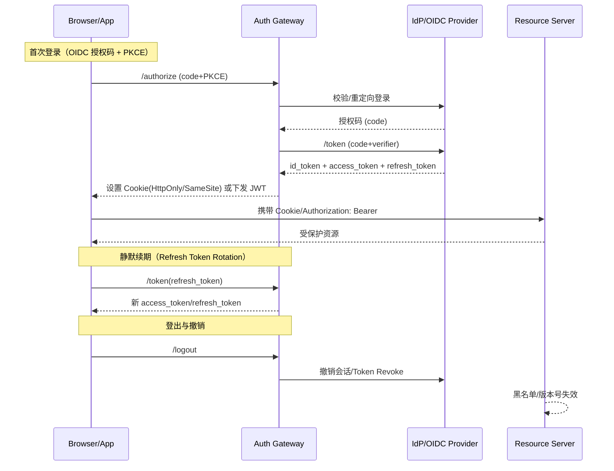

## 前端登录鉴权如何设计？✅  {#p0-login}

<Answer>

## 一、概览

**基于 OIDC/OAuth2 + Session/JWT 的多终端登录鉴权体系，覆盖 SSO、刷新与撤销、跨域与子域、安全对抗（CSRF/XSS/重放）与权限治理（RBAC/ABAC），并具备可观测与灰度能力。**

---

## 二、目标与指标（SLO）

1. 登录成功率 ≥ 99.9%；异常可回退（短信/邮箱二次校验）。
2. 端到端首登 < 800ms，续期/静默刷新 < 200ms。
3. 会话一致性：多端同步登出 ≤ 3s；撤销后旧 Token 失效 ≤ 1s。
4. 安全合规：全链路 HTTPS；PII 脱敏审计；最小权限与最短可用期。

---

## 三、系统架构与核心流程

---

## 四、会话与存储模型

- Session Cookie（首选同域/同组织子域）：`HttpOnly + Secure + SameSite=Lax/Strict`；CSRF 使用双重 Submit/自定义 Header + SameSite 防护。
- JWT（跨域/多端）：短效 Access Token（5~15min）+ 长效 Refresh（7~30d）+ Rotation；服务端维护撤销表/版本号，与网关本地缓存共同生效。
- 统一 IdP：支持 SSO、MFA、设备绑定、风控（IP/UA/地理）。

---

## 五、权限与前端控制

- 鉴权网关统一验签/验权；后端二次校验与审计。
- 前端路由守卫：基于角色/策略拉取权限，按路由 meta/组件粒度控制展示与交互；按钮级按能力点灰/隐。
- 支持 RBAC + ABAC（资源/环境/风险评分）。

---

## 六、安全要点

- PKCE（SPA/Native 必备）；CSP + XSS 防御；同源策略与 iframe 沙箱；重放防护（nonce/时间窗）。
- OAuth2.1/Device Flow/QR：统一回调白名单；状态参数 state 绑定 CSRF token。

---

## 七、可观测与告警

- 登陆漏斗（展示→提交→挑战→成功）、失败原因分布（密码错误/验证码/风控）。
- Token 续期成功率、撤销生效延迟、跨端登出一致性；异常突增告警与灰度开关。

---

## 八、扩展与兼容

- 多子域共享：顶级域 Cookie + 子域隔离；跨域用 OIDC + 回调。
- 扫码/设备码：长轮询/WebSocket 通道；一次性 code + 绑定校验。

---
**面试官视角:**

- 是否能权衡无状态/有状态会话、登出与撤销、刷新令牌与滚动；CSRF/XSS

**延伸阅读:**

- OAuth2.1/PKCE、RFC 6265（Cookie）、OpenID Connect Core

</Answer>
