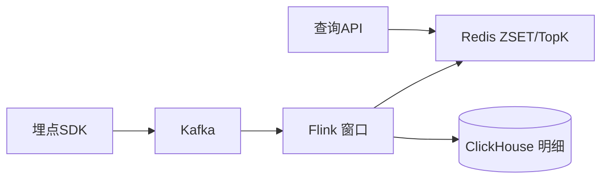

# 如何实现一小时内的 Top10 播放榜？ ✅{#P0-top10k}

<Answer>

## 一、概览

**近实时 1 小时 Top10：事件流 + 滑动窗口统计 + Redis ZSET/TopK 维护，处理迟到/乱序与去重，低延迟查询。**

---

## 二、目标与指标（SLO）

1. 统计延迟 ≤ 5s；查询 P95 < 20ms。
2. 迟到事件（≤ 2min）纠错率 ≥ 99.9%。

---

## 三、架构

---

## 四、核心设计

- 窗口：滚动/滑动（步长 1m，窗口 60m）；Watermark 处理乱序；允许迟到 2m，侧输出纠错。
- 去重：同用户同视频冷却时间（如 10s）或会话级去重；Bloom/HyperLogLog 做近似去重。
- 存储：Redis `top:2025-08-25T10:00` 分桶；同时维护总榜键；过期清理旧桶。
- 查询：按当前时间取最近 60 个桶合并 TopK 或直接读聚合榜键；返回详情补充从 CH 拉取。

---

**面试官视角:**

- 关注迟到/乱序事件处理、去重策略与内存成本；一致性与延迟权衡

**延伸阅读:**

- Count-Min Sketch/TopK、Flink Window 机制、Redis Sorted Set

</Answer>
