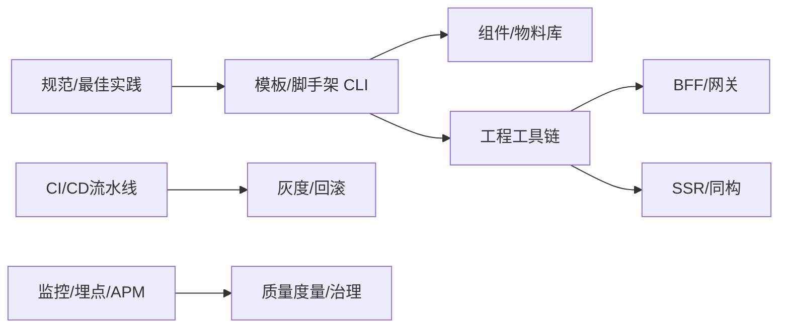

# 如何从 0 到 1 搭建前端基建？ {#P1-base-infrastructure}✅

<Answer>

## 一、概览

**从 0 到 1 的前端基建：以规范/模板/CLI 为起点，建设组件与工具链、BFF/SSR、CI/CD 与可观测，逐步形成覆盖效率、质量与稳定性的端到端体系。**

---

## 二、目标与度量（SLO）

1. 效率：新项目创建 < 2 分钟，常用脚手架覆盖 80% 场景；构建时间降低 30%。
2. 质量：门禁（Lint/Test/Coverage）全绿率 ≥ 98%；变更回滚 ≤ 5 分钟。
3. 稳定：发布失败率 ≤ 1%；监控告警平均响应 < 5 分钟。

---

## 三、总体架构

---

## 四、实施路径

- 第一阶段：规范与模板（代码规范、提交规范、目录约定、模板仓库与 CLI）。
- 第二阶段：组件与工具链（UI/图标/主题、打包/构建优化、Mock、跨端适配）。
- 第三阶段：服务能力（BFF/网关、SSR、鉴权、配置中心）。
- 第四阶段：CI/CD 与可观测（流水线门禁、灰度、回滚、RUM/APM/日志）。

---

## 五、关键落地

- 规范：ESLint/Prettier/Stylelint/Commitlint + Husky + lint-staged。
- 模板：多模板矩阵（SPA/SSR/MicroApp/Lib），可插拔特性。
- 组件：设计令牌/多主题；文档站 + 例子 + 视觉回归。
- 工具链：Monorepo（pnpm + turbo/nx），按需构建与缓存。
- BFF：统一鉴权、聚合接口、缓存与限流；契约测试。

---

## 六、可观测与治理

- 指标：Lead Time、变更失败率、恢复时间、部署频率（DORA）；构建时长/命中率。
- 质量：覆盖率阈值、静态扫描、依赖漏洞提醒；性能基线对比。

---

**面试官视角:**

- 关注基建优先级与阶段目标、收益度量与组织协同；风险与回滚策略

**延伸阅读:**

- Accelerate、工程效能度量体系、前端工程化最佳实践

</Answer>
