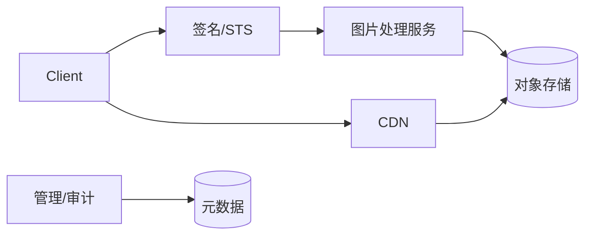

# 如何设计图床系统？ {#P1-image-hosting}✅

<Answer>

## 一、概览

**图床系统：直传加速 + 多规格处理 + CDN 分发 + 权限与风控治理，确保高可用与成本可控。**

---

## 二、目标

1. 上传 P95 < 200ms 首包；热点抗压 5w QPS。
2. 处理链（裁剪/格式转换）可观测与失败重试；原图保留策略可配置。

---

## 三、架构

---

## 四、关键设计

- 直传/分片/断点；鉴权与防盗链；签名 URL。
- 多规格：按需生成/延迟生成；缓存 Key 设计（Vary、DPR）。
- 审计与治理：配额/清理/回收；鉴黄/木马扫描。

---

**面试官视角:**

- 关注热点/大图/原图保留策略、鉴权与防盗链、成本与性能

**延伸阅读:**

- CDN 缓存策略、图片处理网关、S3/OSS 安全与签名

</Answer>
