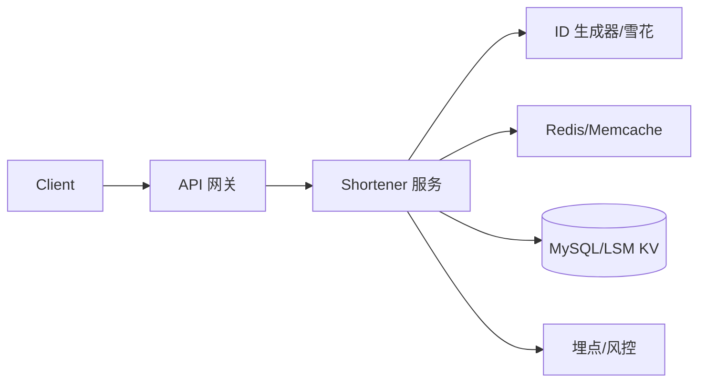

---

sidebar_position: 9
---

# 如何设计短链系统？ {#P1-short-url}

<Answer>

## 一、概览

**高可用短链服务：Base62/分布式 ID 生成 + KV 主存储与多级缓存，支持跳转追踪、防滥用、过期与禁用治理，保障低延迟与热点抗压。**

---

## 二、目标与指标（SLO）

1. 生成短链 P95 < 50ms；跳转 P95 < 20ms（命中缓存）。
2. 热点短链抗 10w QPS；可用性 ≥ 99.95%。
3. 过期/禁用生效延迟 ≤ 5s。

---

## 三、架构

---

## 四、核心设计

- 编码策略：自增区间 + Base62；或雪花 ID 去中心。自定义别名需唯一校验与冲突重试。
- 存储模型：`code -> url(meta)`；meta 含过期、租户、阈值、策略。冷热分层与归档。
- 缓存：读路径 Cache-Aside；热点预热/穿透保护（布隆过滤/空值缓存）。
- 跳转：HTTP 301/302；附带 Trace/UTM；可灰度审查或中间页校验。
- 运营治理：批量/自定义；过期/禁用；黑白名单；速率限制与验证码联动。

---

## 五、可观测

- 指标：生成/跳转 QPS、P95/P99、缓存命中率、热点 TopN、禁用命中率。
- 追踪：code 解析耗时分布、穿透比例、丢失与重试。

---

**面试官视角:**

- 关注短链冲突/热点与一致性；防刷/风控与多租户；回收/过期策略

**延伸阅读:**

- Twitter Snowflake、Redis HyperLogLog/布隆过滤器

</Answer>
