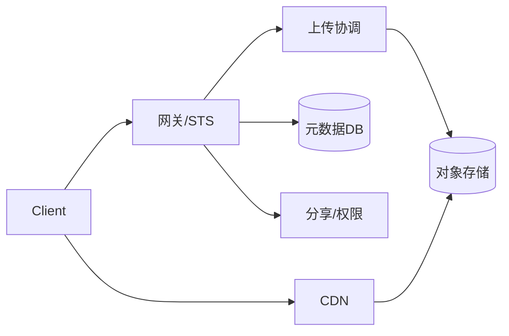

# 如何设计云盘系统？✅ {#P1-cloud-disk}

<Answer>

## 一、概览

**面向大文件的云盘：分片/断点续传/秒传 + 版本与回收站，基于对象存储与 CDN 加速，覆盖分享鉴权、配额与生命周期治理。**

---

## 二、目标与指标（SLO）

1. 上传成功率 ≥ 99.9%，大文件（>5GB）断点续传可恢复。
2. 断点续传重试指数退避，合并成功率 ≥ 99.99%。
3. 下载 P95 < 100ms 首包（CDN 命中）。

---

## 三、架构

---

## 四、上传与下载

- 直传：临时凭证 STS + 预签名；分片并发（动态分片大小），失败重试与跳过已完成块。
- 秒传：MD5/ETag 指纹比对；服务端查重与引用计数。
- 合并：服务端校验分片列表与哈希；幂等 key 保证重复请求安全。
- 下载：Range/断点续传；CDN 鉴权与签名 URL；带宽自适应限速。

---

## 五、权限与分享

- 权限模型：拥有者/协作者/访客；Link 权限（公开/私密/限时/限次），密码/验证码二次校验。
- 审计：下载/预览日志、外链访问统计，异常告警（异常 IP/UA/地区）。

---

## 六、治理与成本

- 配额/生命周期：空间配额、文件生命周期（热/冷/归档），回收站与版本管理。
- 内容安全：病毒/敏感识别；大规模扫描异步队列 + 隔离区。

---

**面试官视角:**

- 关注一致性/幂等（重复上传、重试）、大文件可靠性、权限与审计

**延伸阅读:**

- S3 多分段上传、Range/ETag、对象存储一致性

</Answer>
