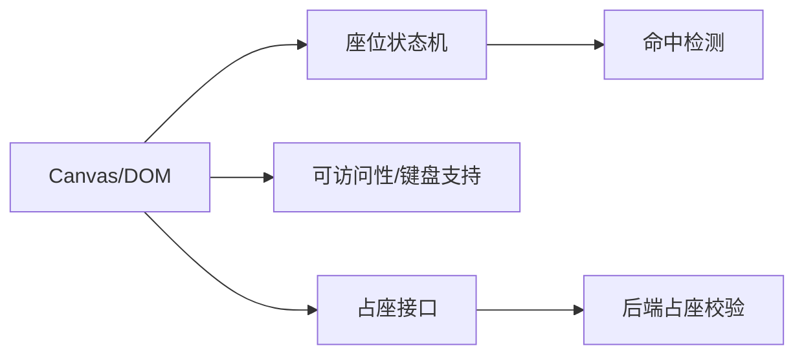

---

sidebar_position: 11
---

# 前端如何用 Canvas 实现电影院选座？ {#P1-cinema-seat}

<Answer>

## 一、概览

**前端选座系统：Canvas/DOM 分层绘制 + 命中检测与状态机，支持并发占座校验与无障碍，保障流畅交互与一致性。**

---

## 二、目标

1. 大厅 100x100 座渲染帧率 ≥ 50fps；交互延迟 < 16ms。
2. 并发校验：锁与占座一致性，错误可恢复（回滚与重试）。

---

## 三、架构

---

## 四、关键设计

- 状态：空/售/选/锁定；批量选择与邻座校验；区域重绘与离屏 Canvas。
- 并发：下单链路先锁定（TTL），支付成功转售；失败释放；幂等键避免重复。
- 无障碍：ARIA/焦点环；键盘方向移动与范围选择；色盲配色。

---

**面试官视角:**

- 关注选座规则/并发占座校验、性能与可访问性、端到端一致性

**延伸阅读:**

- Canvas 性能优化、离屏渲染、命中测试与事件绑定策略

</Answer>
