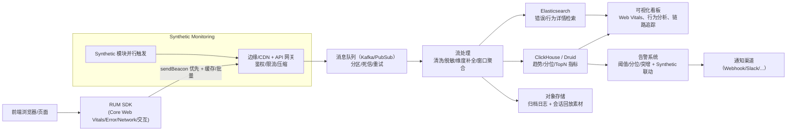

# 如何做好前端监控方案 {#P1-monitor}✅

<Answer>

## 一、概览

**基于轻量 SDK + RUM＋Synthetic 监控 + 边缘接入 + 流式聚合 + 分层存储 + 分布与告警治理的端到端系统，实现前端体验感知、快速定位、可扩展告警与链路追踪。**

---

## 二、设计目标（SLO 与核心指标）

1. **用户体验为核心**：

   * 包含 **Core Web Vitals**（LCP < 2.5s, FID < 100ms, CLS < 0.1）作为核心指标 ([Middleware][1])。
2. **真实用户 + 合成监控双策略**：

   * RUM 捕获真实用户体验，Synthetic Monitoring 提前发现问题补充覆盖 ([Middleware][1], [维基百科][2])。
3. **采集效率与端开销控制**：SDK < 8 KB gzip；sendBeacon 优先，卸载、不可见时 flush。
4. **数据完整性与可靠性**：上报成功率 ≥ 98%，丢失率 ≤ 1%；IndexedDB 缓存 + 重试机制。
5. **实时性与告警**：90% 数据 2 分钟内可查询；超阈值快速告警。
6. **可扩展与成本优化**：亿级事件级别、冷热分层存储、线性扩容。
7. **安全合规**：PII 脱敏、TLS 加密、审计日志、数据保留策略。
8. **可定位性与全链路追踪**：支持 Source Map 符号化与 W3C Trace Context。

---

## 三、系统架构与核心流程

---

## 四、前端 SDK 设计要素

* **性能采集**：Core Web Vitals + 一般性能指标、页面路由变化与用户交互事件 ([Datadog][3])。
* **错误处理**：JS 异常、资源 & XHR/fetch 错误，全量采集与 Source Map 符号化。
* **采样策略**：普通事件会话抽样（如20%），错误与慢请求全量；支持服务端 tail-based sampling ([Datadog监控][4])。
* **离线保障**：IndexedDB 本地缓存、指数退避、TTL 限制、批量发送机制。
* **发送机制**：sendBeacon 优先，fallback fetch/image；在 visibility hidden / unload 时触发 flush。
* **行为回放支持**（可选）：记录关键 DOM state 与交互，用于后端回放分析。
* **链路追踪**：兼容 W3C Trace Context，用于前后端 trace 关联。

---

## 五、流式处理与数据存储

* **接入层**：CDN/边缘 + API 网关处理鉴权、压缩、防刷与限流；
* **流处理**：清洗、脱敏、补全 UA/IP/Geo、聚合（1m/5m）；
* **存储分层**：

  * **ClickHouse / Druid**：趋势分析、分位计算、TopN；
  * **Elasticsearch**：详情检索、错误 & 行为聚类；
  * **对象存储**：历史原始明细与回放素材归档，支持生命周期管理；
* 支持多租户、项目/版本/环境维度分区管理。

---

## 六、可视化与告警机制

* **看板内容**：

  * Web Vitals 趋势 & 分布（P95/P99）、错误统计、Top 页面与接口详情、用户路径与痛点行为分析（如 rage clicks） ([Datadog][5])。
  * Synthetic 与 RUM 数据对比呈现。
* **告警策略**：

  * 阈值告警（如 LCP>2.5s）、分位告警（P95 上升）、同比/突增监控机制；
  * 支持静默期、告警去重与规则组合；
  * 告警触发可联动 Synthetic 背壳监测加速定位；
  * 通知渠道覆盖 Webhook、Slack、飞书等。

---

## 七、扩展性与可靠性规划

* **容量规划**：亿级事件通过 MQ 分区、边缘 API 与流处理集群水平扩容。
* **冷热分层存储**：实时指标放在 CH/ES，历史归档至对象存储降低成本。
* **动态采样与自监控**：根据流量、错误率自动调整采样比例；系统自我监控告警。
* **多端一致协议**：后续兼容 Native、小程序 SDK，统一监控格式。
* **合规扩展**：支持 GDPR 删除请求与区域化隐私策略。
* **AI 异常检测**：引入机器学习实现异常突增／行为异常报警能力。

---

## 延伸阅读

[1]: https://middleware.io/blog/core-web-vitals-with-rum-synthetic-monitoring/?utm_source=chatgpt.com "Monitor Core Web Vitals with RUM & Synthetic Monitoring"
[2]: https://en.wikipedia.org/wiki/Synthetic_monitoring?utm_source=chatgpt.com "Synthetic monitoring"
[3]: https://www.datadoghq.com/blog/modern-frontend-monitoring/?utm_source=chatgpt.com "Best practices for modern frontend monitoring"
[4]: https://docs.datadoghq.com/real_user_monitoring/guide/best-practices-for-rum-sampling/?utm_source=chatgpt.com "Best Practices for RUM Sampling"
[5]: https://www.datadoghq.com/blog/using-rum-to-improve-ux/?utm_source=chatgpt.com "How we use RUM to make design decisions that enhance ..."

</Answer>
