# 响应式范式与 Signals ✅

本主题探讨现代前端响应式范式的演进脉络，深入对比 Virtual DOM 与细粒度响应式（Fine-Grained Reactivity / Signals）的核心哲学与架构取舍。

## 现代前端响应式范式演化：为什么从 Virtual DOM 转向 Signals（细粒度响应式）？TC39 Signals 标准如何影响未来框架？ {#p0-reactivity-signals-vs-vdom}

<Answer>

**核心结论**

前端框架在过去十余年的发展中，核心争夺点始终是**“状态（State）如何以最低开销驱动视图（DOM）保持一致”**。这经历了两次划时代的范式转移：
1. **第一代：模板指令与脏检查（AngularJS / Vue 1）**：通过观察者模式或作用域全量轮询，数据规模膨胀时性能断崖式下跌；
2. **第二代：虚拟 DOM 与组件级重渲染（React / Vue 2/3）**：React 提出了纯函数式 UI 概念（`UI = f(state)`）。每次状态变更，自顶向下重新执行组件函数，生成整棵轻量虚拟 DOM 树（V-DOM）并进行 Diff。虽然开发心智模型简单，但其代价是巨大的：频繁创建短期 VDOM 对象引发 GC 压力、组件级无谓重执行，以及开发者必须手动维护 `useMemo` / `useCallback` 来防止子树雪崩；
3. **第三代：细粒度响应式与 Signals 信号模型（SolidJS / Angular Signals / Vue 3.5 / Svelte 5 / Preact）**：
   - **组件只运行一次（Run Once）**：组件函数退化为单纯的“依赖装配流水线”，仅在初始挂载时调用一次构造依赖图；
   - **点对点精准突变（Fine-Grained Updates）**：状态是一个具备自动订阅能力的值容器（Signal）。当值改变时，更新沿着有向无环依赖图（DAG）精准推送给具体的 DOM 文本节点或属性绑定指令，完全**越过组件层级，零 VDOM 分配，零树 Diff 运算**！
4. **TC39 Signals 规范提案**：由来自 Vue、Solid、Preact、Angular 等主流框架核心作者联合推动，旨在将细粒度响应式数据结构（`Signal.State`、`Signal.Computed`）沉淀为 JavaScript 语言原生底层基础设施，彻底终结框架生态各自为政的响应式胶水代码。

---

**Virtual DOM vs Signals 响应式更新架构拓扑对比**

```mermaid
flowchart TD
    subgraph VDOMModel["Virtual DOM 范式 (粗粒度: 组件级整体重渲染)"]
        VState["状态修改 (setState)"] --> VComponent["组件函数重新执行 (Re-render)"]
        VComponent --> VTreeNew["生成全新 Virtual DOM 树"]
        VTreeNew --> VDiff["深度优先 Diff 对比 (旧树 vs 新树)"]
        VDiff --> VBatch["生成 DOM 变更指令集 (Patch)"]
        VBatch --> VRealDOM["批量应用到真实 DOM"]
    end

    subgraph SignalModel["Signals 细粒度响应式 (点对点: 依赖拓扑精准突变)"]
        SState["信号状态修改 (count.set(newValue))"]
        SGraph["依赖拓扑图 (Dependency Graph) 自动唤醒"]
        SState --> SGraph
        SGraph -.->|"越过组件树! 直接精准直达"| SBinding["已绑定的单一 DOM 文本节点 (textNode.data = newValue)"]
    end
```



---

**规范代码：从零实现一个极简但完备的 Signals 运行时**

以下代码展示了现代 Signals 的三大核心要素：自动依赖收集上下文栈、双向拓扑关联、计算缓存与批量派发：

```typescript
// 1. 全局运行栈: 用于追踪当前正在执行的响应式副作用 (Effect)
let activeSubscriber: (() => void) | null = null;

// 2. 状态信号 (State Signal)
export class Signal<T> {
  private value: T;
  private subscribers = new Set<() => void>();

  constructor(initialValue: T) {
    this.value = initialValue;
  }

  // 读取值: 自动收集依赖 (Track)
  get(): T {
    if (activeSubscriber) {
      this.subscribers.add(activeSubscriber);
    }
    return this.value;
  }

  // 写入值: 触发更新 (Trigger)
  set(newValue: T): void {
    if (this.value !== newValue) {
      this.value = newValue;
      // 拷贝订阅者集合并广播，避免迭代中产生副作用死循环
      const toNotify = Array.from(this.subscribers);
      toNotify.forEach(subscriber => subscriber());
    }
  }
}

// 3. 计算信号 (Computed Signal) - 具备惰性求值与缓存能力
export class Computed<T> {
  private fn: () => T;
  private cachedValue!: T;
  private isDirty = true;
  private subscribers = new Set<() => void>();

  constructor(fn: () => T) {
    this.fn = fn;
    // 监听上游信号的变更，将自身标记为脏 (Dirty)
    effect(() => {
      this.isDirty = true;
      const toNotify = Array.from(this.subscribers);
      toNotify.forEach(sub => sub());
    });
  }

  get(): T {
    if (activeSubscriber) {
      this.subscribers.add(activeSubscriber);
    }
    if (this.isDirty) {
      this.cachedValue = this.fn();
      this.isDirty = false;
    }
    return this.cachedValue;
  }
}

// 4. 副作用执行器 (Effect)
export function effect(fn: () => void): () => void {
  const execute = () => {
    activeSubscriber = execute;
    try {
      fn();
    } finally {
      activeSubscriber = null;
    }
  };
  execute(); // 立即执行建立首次依赖收集

  // 返回销毁取消订阅函数
  return () => {
    activeSubscriber = null;
  };
}

// 5. 简易包装工厂函数
export const createSignal = <T>(val: T) => new Signal(val);
export const createComputed = <T>(fn: () => T) => new Computed(fn);
```

```typescript
// 6. 业务消费示例：无组件重执行的极速更新
const count = createSignal(10);
const double = createComputed(() => count.get() * 2);

// 创建绑定真实 DOM 的精准更新副作用
const domTextNode = document.createTextNode(String(double.get()));
effect(() => {
  // 当 count 改变时，仅此回调被触发，直接突变文本节点!
  domTextNode.data = String(double.get());
  console.log('DOM 节点被精准更新为:', domTextNode.data);
});

count.set(20); // 输出: DOM 节点被精准更新为: 40
```

---

**关键哲学对比矩阵**

| 对比维度 | React (Virtual DOM / Fiber) | SolidJS / Angular Signals / Vue Vapor |
| :--- | :--- | :--- |
| **状态颗粒度** | 粗粒度（组件作用域内的数据快照） | 细粒度（每个独立的响应式值原子） |
| **组件生命周期** | 每次状态变更都完整重新调用组件函数 | 组件函数只在初次装配时调用一次 |
| **心智模型包袱** | 需严格管理 `deps` 依赖项、防止闭包陷阱、手动记忆化 | 读值即自动收集依赖、无闭包陈旧值风险 |
| **内存开销** | 每次更新分配海量 VDOM 临时对象，GC 压力大 | 仅维持一份固定的依赖图拓扑，内存极度稳定 |
| **编译期依赖** | 依赖 React Compiler（Forget）构建期推断 | 编译期直接将 JSX 编译为细粒度原生 DOM 指令 |

---

**面试官视角与下探考察点**

1. **React 为什么坚守 Virtual DOM 不跟进 Signals？**：
   - 面试官通常会追问：“React 团队难道不知道 Signals 性能更快吗？为什么 React 坚持走 React Compiler 路线而不是 Signals？”
   - 深度洞察：React 坚守其**“纯函数、不可变数据（Immutability）与可预测并发调度（Concurrent Mode）”**的哲学底色。在 React 的并发时间切片模型中，任务可以被暂停、废弃、多分支推演（如 `useTransition` 乐观推演）；而在 Signals 的可变依赖拓扑中，状态写入是同步精准推送的，缺乏中央调度器对渲染帧时序的全局掌控力。React 选择通过 React Compiler 构建期 HIR 分析自动插入记忆化，在保留函数式心智的同时降低手工优化负担。
2. **信号的毛刺现象（Glitch / Diamond Problem）与调度算法**：
   - 在菱形依赖（Diamond Dependency）场景下（A 驱动 B 和 C，D 依赖 B 和 C），如何避免 D 被错误地触发两次中间状态？
   - 架构解法：现代 Signals 采用 **两阶段提交（Push-Pull / Mark-Sweep）** 机制。写入时仅向拓扑下游下发“脏标记（Push Dirtiness）”，只有当真正需要读取最终值时才执行拉取计算（Pull Re-evaluation），确保状态更新的强一致性与无毛刺（Glitch-free）。

---

**延伸阅读**

- [TC39 JavaScript Signals 官方标准提案](https://github.com/tc39/proposal-signals)
- [Ryan Carniato: A Hands-on Introduction to Fine-Grained Reactivity](https://dev.to/ryansolid/a-hands-on-introduction-to-fine-grained-reactivity-3ndf)
- Vue 3.5 响应式系统重构与 Vapor Mode 架构演进

</Answer>
