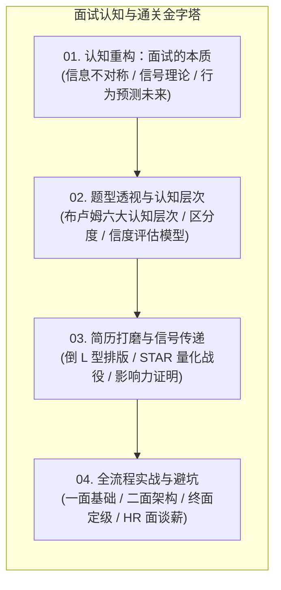

# 面试方法论与通关指南

欢迎查阅《前端面试方法论与通关指南》。本指南面向**求职者**与**面试官**，旨在打破招聘过程中的“信息不对称”，基于认知科学、信号理论与大厂真实用人标准，构建系统性的面试通关与人才评估认知框架。

---

## 知识金字塔全景图

---

## 章节导读

| 模块 | 核心内容 | 目标受众与价值 |
| :--- | :--- | :--- |
| [01. 认知重构：什么是面试](./01.what-is-interview.md) | 从经济学“柠檬市场”与“信号理论”拆解面试本质；为什么过去的行为是未来绩效的最佳预测指标。 | **求职者**：建立正确的面试心智，拒绝盲目背题； **面试官**：理解岗位匹配与信息挖掘的底层逻辑。 |
| [02. 题型透视：布卢姆认知层次与好题模型](./02.bloom-taxonomy-questions.md) | 引入布卢姆教育目标分类学（记忆、理解、应用、分析、评价、创造），解剖好题的标准（有效性、信度、区分度）。 | **求职者**：学会向面试官展示“分析/评价/创造”高阶能力； **面试官**：掌握科学出题与客观评分 Rubric。 |
| [03. 简历打磨：大厂简历撰写与量化法则](./03.resume-guide.md) | 简历命名、黄金排版原则、超强技能点表述法，如何把复杂的业务与架构战役提炼为有说服力的数字。 | **求职者**：提升简历通过率，打造能够引导面试官提问的“钩子”。 |
| [04. 全程通关：从一面到 HR 面避坑实战](./04.interview-journey.md) | 拆解电话沟通、技术一面（基础/深度）、二面（系统设计/架构大局观）、三面（综合潜力）与 HR 面避坑全流程。 | **求职者**：掌握各轮次核心考察要点与应对策略，避免踩坑。 |

---

## 核心原则

1. **价值传递优先于单纯博弈**：面试不是考试打分，而是在有限时间内向雇主传递自己的不可替代价值。
2. **用真实战役证明能力**：拒绝干瘪的术语罗列，用清晰的“指标定义 → 架构归因 → 工程动作 → 量化结果”展示专业素养。
3. **金字塔式表达**：先给结论，再展开分层原理解析，最后以边界和延伸升华。
